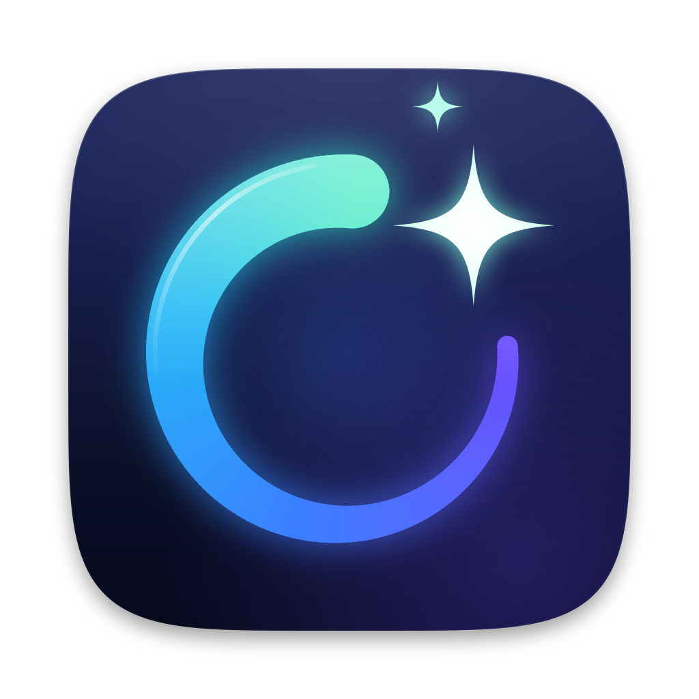

<p align="center">
  
</p>

<h1 align="center">oh-my-clear</h1>

<p align="center">
  A fast, refined, keyboard-first system cleaner for macOS, Windows and Linux.
</p>

<p align="center">
  <a href="LICENSE"></a>
  
  
</p>

## Features

- **Native & fast** — written in Rust on [gpui-kit](https://gpui-kit.com), GPU-rendered UI.
- **Two processes** — a lightweight GUI plus a background daemon that does the actual work and lives in the system tray.
- **Cross-platform** — macOS, Windows (MSVC) and Linux are all first-class.
- **Polished UX** — keyboard-first, Apple-style spring motion, light/dark themes, English and 简体中文.
- **Cleaning** — system junk (caches, logs, crash reports, temp files, update and package caches), browser data (caches by default; cookies, history, site data and sessions only when you opt in), developer junk (Xcode, package-manager and IDE caches, build output of projects you haven't touched), Trash / Recycle Bin, old installers, and leftovers of apps that are gone.
- **Storage** — Space Lens (a two-level treemap of what fills a folder, with drill-down), large and old files, byte-identical duplicates (hard links and cloud placeholders are never counted or downloaded).
- **Uninstaller** — removes an app together with its support files, caches, preferences, containers, launch agents, receipts and (Windows) registry keys, services and scheduled tasks; runs the vendor uninstaller or package manager first, backs up registry keys, and asks for the administrator password once. Startup items can be disabled, re-enabled or removed.
- **Safe by default** — every item is listed with its path and size before anything is removed; only items the system recreates are preselected; user files go to the Trash; exclusions, age limits and confidence levels are configurable in Settings.
- **Scans when it's cheap** — quick areas (Trash, browser data, system junk, installers, leftovers, apps, startup items) rescan automatically when opened and their results are stale; heavy ones (developer junk, large files, duplicates, Space Lens) only on request. Overview results carry over to each area.

## Build

Requires the Rust toolchain pinned in `rust-toolchain.toml` (Windows also needs MSVC Build Tools).

```sh
cargo omc      # build the daemon and run the app
cargo daemon   # run the daemon alone, in the foreground
```

## Development

```sh
cargo ci       # all gates: layers, fmt, clippy, nextest, cargo-deny
```

Tests run with [cargo-nextest](https://nexte.st); dependency checks need [cargo-deny](https://github.com/EmbarkStudios/cargo-deny). See [`AGENTS.md`](AGENTS.md) for architecture and conventions, and [`docs/memory/decisions/`](docs/memory/decisions/) for design records.

## License

[GNU Affero General Public License v3.0](LICENSE) © zerx-lab
