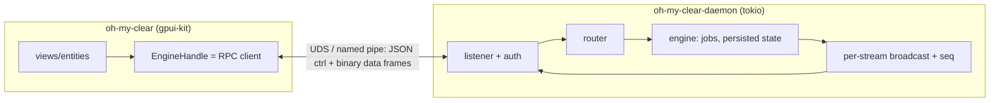

<!-- Research snapshot 2026-09-28. Point-in-time evidence: versions/dates/activity go stale; /tmp probe paths mentioned below were deleted after the session. Decisions derived from this belong in docs/memory/decisions/. -->

# UI process ⇄ background daemon: process layout, IPC, lifecycle, reattach

Research date 2026-09-28. All crate numbers come from the crates.io API (`/api/v1/crates/<name>`). Repo activity comes from the GitHub API (`pushed_at`) or the Codeberg API. Advisories come from `rustsec/advisory-db/crates/<name>`. std facts were read from the pinned toolchain's `rust-src` (1.98.0). Upstream designs were read from source at HEAD on 2026-09-28. Throwaway probes ran on an Apple M5 under macOS 27 (`/tmp/DaemonIpcResearch`, now deleted). Anything I did not check directly is marked [UNVERIFIED]. Anything I derived rather than read is marked [INFERENCE].

---

## 0. Recommendation (TL;DR)

| Area | Pick |
|---|---|
| **Processes / binaries** | Two binaries. **`oh-my-clear`** is the GUI: it links gpui-kit and is a thin viewport plus an RPC client. **`oh-my-clear-daemon`** is headless: tokio, engine, persisted state, and no gpui, so it runs on headless Linux. `oh-my-clear-daemon` also hosts the subcommands `run` (default, foreground), `status`, `stop`, `restart`, `logs`, and `install-login-item`. |
| **New crates** | `crates/omc-ipc` holds framing, handshake, and the transport per OS (`omc-proto` stays I/O-free). `apps/oh-my-clear-daemon` is the new binary. `EngineHandle` becomes an RPC client. Tests use an in-memory `tokio::io::duplex`, so the in-process boundary runs the same codec. |
| **Transport** | macOS/Linux: `tokio::net::UnixListener`/`UnixStream`. Windows: `tokio::net::windows::named_pipe`. Both are tokio-only: no `interprocess`, no Windows AF_UNIX. |
| **Security** | (1) A per-user private runtime dir: `0700`, owner verified tmux-style. (2) A `peer_cred().uid() == getuid()` check on Unix. (3) Windows: a **random, unguessable pipe name** plus `first_pipe_instance(true)` and `reject_remote_clients(true)`. (4) On every OS, a **256-bit token** read from a user-private endpoint file. It must be the first frame, and the daemon writes **nothing** before it verifies the token. This closes the gap left by the default pipe DACL, which gives Everyone read access. There is never a TCP listener. |
| **Discovery** | `endpoint.json` is written atomically (tmp + rename) and holds `{protocol, build_id, pid, epoch, started_at, address, token}`. It lives in the runtime dir: Linux `$XDG_RUNTIME_DIR/oh-my-clear/`, fallback `/tmp/oh-my-clear-<uid>/`. macOS `~/Library/Application Support/<bundle-id>/run/`, falling back to `$TMPDIR/oh-my-clear/` when the socket path would be ≥104 bytes. Windows `%LOCALAPPDATA%\oh-my-clear\run\`. |
| **Single instance** | `std::fs::File::try_lock()` (stable since 1.89) on `daemon.lock`, taken **before** persisted state opens and before the bind. Only the lock holder may unlink or rebind the socket path. No link/rename ownership protocol is needed. |
| **Spawn** | The UI auto-spawns the daemon if it cannot connect and the lock is free. Unix: `CommandExt::process_group(0)` (stable since 1.64). Windows: `creation_flags(DETACHED_PROCESS \| CREATE_NEW_PROCESS_GROUP [\| CREATE_BREAKAWAY_FROM_JOB])`. stdin is null, stdout is piped for a one-line `READY` handshake, and stderr goes to a log file. No `unsafe` is needed and there is no `daemonize` crate. |
| **Wire format** | Length-prefixed frames: `u32 LE len \| u8 kind \| payload`. Kind `0x01` is a **serde_json** control envelope (request, response, or notification). Kind `0x02` is a **raw binary data frame** (`u64 stream \| u64 seq \| bytes`) for bulk byte streams. This adds no new serialization crate. |
| **Versioning** | `hello {protocol, build_id, token, client_id, resume}` → `welcome {protocol, build_id, epoch, pid}`. A **frozen meta subset** (`hello`, `status`, `drain`, `shutdown`) never changes. On a mismatch, the flow is drain → restart handoff. |
| **Resync** | Every stream has a monotonic `seq` persisted by the daemon. `subscribe{stream, since}` returns a replay if `since` is still retained, otherwise `snapshot` + live. A new `epoch` means discard all client caches. Slow consumers get `lagged` and resync. They never block the engine. |
| **Idle policy** | The daemon exits only when there are 0 clients **and** 0 active jobs **and** it has been idle for 10 min (Zed's `IDLE_TIMEOUT`). There is also an explicit "Quit oh-my-clear and stop background work". |
| **Logs / health** | `tracing-appender` 0.2.5, daily rotation, `max_log_files(14)`. The UI status pill shows attached / reconnecting / upgrading / stopped, with a 5 s ping and a 20 s timeout (VS Code's constants). |
| **Start at login** | Opt-in. It shells out to the platform tool: `launchctl bootstrap gui/<uid>` with a `~/Library/LaunchAgents` plist, `systemctl --user enable`, and on Windows an HKCU `Run` value or `schtasks /SC ONLOGON`. SMAppService is deferred because it needs `unsafe` objc2 calls. |
| **Packaging** | macOS: the helper goes in `Contents/MacOS/oh-my-clear-daemon`, signed and notarized with the app. Windows and AppImage: **relocate** the daemon exe to a per-version host dir before spawning. Flatpak: no for v1. |

Why this and not the alternatives: see §2–§6. The design is a pipeline with no cycles, and the only shared contract is the `omc-ipc` frame and envelope types:



---

## 1. Reference designs

### 1.1 tmux (github.com/tmux/tmux)
- **Discovery / security.** `tmux.c` builds `<TMUX_TMPDIR or /tmp>/tmux-<uid>/<label>`. It runs `mkdir(base, S_IRWXU)`, then `lstat`, and refuses to start unless `S_ISDIR`, `st_uid == uid`, and `(st_mode & TMUX_SOCK_PERM) == 0` ("directory %s has unsafe permissions"). `server-acl.c` also checks the peer uid (`proc_get_peer_uid`) against an ACL that contains only the owner by default.
- **Versioning.** `tmux-protocol.h` sets `#define PROTOCOL_VERSION 8`. On `MSG_VERSION` the client prints `protocol version mismatch (client %d, server %u)` and exits 1 (`client.c`). tmux makes no attempt at compatibility: the server outlives clients, and a mismatched client refuses to attach.
- **Reattach.** The server owns the full screen state, so a client that attaches gets a redraw. It does not get byte replay. This is the snapshot-on-attach model (§5.4).

### 1.2 zellij (github.com/zellij-org/zellij)
- The transport is the **`interprocess`** crate's `local_socket`. It uses `GenericFilePath` on Unix and `GenericNamespaced` (named pipes) on Windows (`zellij-utils/src/consts.rs` `ipc_connect`/`ipc_bind`). Messages are protobuf (`prost`, `write_protobuf_message` in `ipc.rs`).
- **Versioning is in the path.** The socket dir is `<ZELLIJ_SOCK_DIR | runtime_dir | tmp>/contract_version_<N>` with `CLIENT_SERVER_CONTRACT_VERSION = 1`, so incompatible builds never see each other's sockets.
- **Socket length limit.** zellij encodes it explicitly: `ZELLIJ_SOCK_MAX_LENGTH = 104` on macOS/BSD, 108 on Linux, and 256 on Windows.

### 1.3 wezterm mux server (github.com/wezterm/wezterm, pushed 2026-09-28)
- The socket is `RUNTIME_DIR/sock` (`config/src/unix.rs`). `wezterm-mux-server` runs detached.
- **Framing** (`codec/src/lib.rs`): `tagged_len: leb128 (MSB = zstd-compressed) | serial: leb128 | ident: leb128 | payload (varbincode)`. Payloads larger than `COMPRESS_THRESH = 32` bytes are zstd-compressed. The comment explains why: the enum variant tag is encoded manually "to make it a little easier to manage client and server instances that are built from different versions".
- **Versioning.** `CODEC_VERSION = 45`. The client calls `GetCodecVersion` first and returns `IncompatibleVersionError` if the value differs. This is the "frozen meta subset" pattern: one RPC that never changes shape.

### 1.4 Zed: CLI handoff + remote_server (github.com/zed-industries/zed)
- **Single-instance handoff.** Zed uses three different mechanisms, one per OS:
  - macOS: a localhost UDP-style probe on a port offset by uid and release channel (`mac_only_instance.rs`, 10 ms connect timeout).
  - Windows: a `CreateMutexW("<id>-Instance-Mutex")` plus a named pipe `\\.\pipe\<id>-Named-Pipe` (`windows_only_instance.rs`, raw `unsafe` Win32).
  - Linux: a `UnixDatagram` at `data_dir/zed-<channel>.sock`, and it "remove[s] the socket if the process listening on it has died" (`open_listener.rs`).

  [INFERENCE] oh-my-clear does not need three mechanisms. The daemon is already a per-user broker, so a second `oh-my-clear` launch can connect and forward an open request to an attached UI.
- **remote_server** (`crates/remote_server/src/server.rs`):
  - State lives in `remote_server_state_dir()/<identifier>/{server.pid, stdin.sock, stdout.sock, stderr.sock}`, and the log is `server-<identifier>.log`, rotated by size to `.1.log`.
  - A **proxy** process (`execute_proxy`) bridges ssh stdio to the sockets. When reconnecting it requires a live pid (`ServerNotRunning` otherwise). A fresh connect kills any old server and spawns a new one. It waits up to 10 s, polling every 20 ms, for the sockets to appear.
  - Unix spawn uses null stdio. Windows spawn goes through `shell_execute_from_explorer` (COM ShellExecute via Explorer), which escapes the caller's job object and console.
  - **`IDLE_TIMEOUT = 10 * 60 s`**: "If no connection comes in this timeout, the server will shut down."
  - The binary name and state dir carry the version (`VERSION` = `ZED_PKG_VERSION` or the commit SHA), so versions coexist instead of negotiating.

### 1.5 VS Code server / PersistentProtocol (github.com/microsoft/vscode)
- `src/vs/base/parts/ipc/common/ipc.net.ts` uses a 13-byte header (`type u8 | id u32 | ack u32 | size u32`, `HeaderLength = 13`). Message types are `Regular, Control, Ack, Disconnect, ReplayRequest, Pause, Resume, KeepAlive`.
- **Resume.** Every regular message has an id. The sender keeps `_outgoingUnackMsg` until the peer acks it (`AcknowledgeTime = 2000 ms`). On reconnect it replays the unacked queue, and a `ReplayRequest` is sent "at most once every 10s".
- **Timing constants.** `TimeoutTime = 20000`, `KeepAliveSendTime = 5000`, `ReconnectionGraceTime = 3 h`, `ReconnectionShortGraceTime = 5 min`.
- **IPC handles** (`node/ipc.net.ts` `createRandomIPCHandle`): Windows uses `\\.\pipe\vscode-ipc-<uuid>-sock`, a random name. Unix uses `XDG_RUNTIME_DIR` (non-darwin) or `tmpdir()`, and the uuid suffix is **trimmed to the platform's socket-path limit** because Node ≥24 now fails with `EINVAL` instead of truncating. `createStaticIPCHandle` hashes the directory path and includes the version.
- Server binaries live under `~/.vscode-server/bin/<commit>`, so versions coexist [UNVERIFIED: path from VS Code remote docs/FAQ, not re-read today].

### 1.6 Patterns extracted

| Concern | tmux | zellij | wezterm | Zed remote | VS Code | → oh-my-clear |
|---|---|---|---|---|---|---|
| Discovery | uid dir in tmp | runtime dir + contract ver | runtime dir | state dir per version | random handle, env | runtime dir + `endpoint.json` |
| Version policy | refuse | path-segregated | refuse (codec ver) | path-segregated | commit path | frozen meta + drain/restart |
| Auth | dir perms + uid ACL | dir perms | dir perms | ssh | connection token | dir perms + uid + token |
| Reattach state | server screen | server screen | server screen | reconnect proxy | unacked replay | persisted `seq` replay / snapshot |
| Idle exit | no (until last session) | no | no | 10 min | grace 3 h | 10 min & no work |

---

## 2. Transport

### 2.1 Unix (macOS, Linux): `tokio::net::UnixListener`
- The probe bound, accepted, and echoed with `peer_cred()` returning `uid=501 pid=Some(..)`. **Raw throughput was about 1.5 GB/s** (256 MiB of 64 KiB writes in 174 ms). That is orders of magnitude above any expected event stream.
- A `bind` on a **146-byte path fails** with `path must be shorter than SUN_LEN` (macOS). `sun_path` is 104 bytes on macOS/BSD and 108 on Linux (zellij constants). Keep the socket path short and check its length before bind.
- The socket file was created with mode `755` under the default umask. [UNVERIFIED] BSD/macOS historically ignore socket-file permissions for `connect`. **The 0700 directory is the real guard**, and the `peer_cred` uid check is defense in depth.
- `tokio::net::UnixStream::peer_cred()` is stable. `std::os::unix::net::UnixStream::peer_cred` is **unstable** (`#[unstable(feature = "peer_credentials_unix_socket", issue = "42839")]` in 1.98 rust-src). Use tokio's.

### 2.2 Windows: named pipes (`tokio::net::windows::named_pipe`), not AF_UNIX
- **AF_UNIX on Windows** was added to Windows 10 in 2018 (MS devblog). tokio/mio do **not** expose it: `UnixListener`/`UnixStream` are `#[cfg(unix)]`, and mio PR #1610 (AF_UNIX via AFD) was never merged. std's Windows `UnixStream` is `#![unstable(feature = "windows_unix_domain_sockets", issue = "150487")]`. The only route would be `uds_windows` (1.2.1) plus custom readiness plumbing. It is in the gpui graph via zbus, but it is blocking-only. It also has no peer credentials. → **Not recommended.**
- **Named pipes, which tokio supports natively.** `ServerOptions` offers `first_pipe_instance`, `reject_remote_clients` (on by default: "Remote clients are disabled by default"), `max_instances`, `in/out_buffer_size`, `access_inbound/outbound`, and `write_dac`/`write_owner`. A custom DACL needs `unsafe fn create_with_security_attributes_raw` (tokio `named_pipe.rs:2304`).
- **Default pipe DACL** (MS Learn): "grant full control to the LocalSystem account, administrators, and the creator owner. They also grant **read access to members of the Everyone group** and the anonymous account." Pipe names are machine-global, so oh-my-clear must assume other local users can open the pipe **read-only** and can try to **squat** a predictable name. Mitigations, none of which need `unsafe`:
  1. **Random pipe name** per daemon start, e.g. `\\.\pipe\oh-my-clear-<uuidv4>-<uuidv4>`, published only in `%LOCALAPPDATA%\oh-my-clear\run\endpoint.json`. LocalAppData is user-private by inherited ACL [UNVERIFIED for roaming or redirected profiles]. An unknown name defeats squatting.
  2. `first_pipe_instance(true)` on the first instance. `create` fails with `PermissionDenied` if the name already exists (tokio doc example).
  3. A **token-first handshake, with the server silent until the token verifies**. A read-only (Everyone) handle cannot write the token, so it never receives a byte.
  4. `reject_remote_clients(true)`, which is the default.
- **Optional hardening** is an explicit DACL. `interprocess` exposes a **safe** `SecurityDescriptor::deserialize(&U16CStr)` taking an SDDL string, plus `ListenerOptionsExt::security_descriptor` (`interprocess-2.4.4/src/os/windows/security_descriptor/owned.rs`). An SDDL like `D:P(A;;GA;;;<user-SID>)(A;;GA;;;SY)` needs the user SID string. Getting it takes an `unsafe` token query, or spawning `whoami /user /fo csv /nh`. [UNVERIFIED] Whether the `OW` (owner-rights) alias alone gives the right semantics for elevated tokens, whose default owner may be `BUILTIN\Administrators`. Defer until a threat model demands it.
- **Accept loop.** A tokio named-pipe server must create the **next** instance before handing off the connected one (tokio docs pattern). This takes about 30 lines inside `omc-ipc`.

### 2.3 `interprocess` vs tokio-only

| | tokio-only | `interprocess` 2.4.4 |
|---|---|---|
| Version / date | tokio 1.53.1 (2026-07-20) | 2.4.4 (2026-09-03), MSRV 1.75 |
| Downloads | 1.005 B total / 234 M recent | 15.0 M / 4.2 M recent |
| License | MIT | 0BSD OR Apache-2.0 |
| Repo | tokio-rs, very active | kotauskas/interprocess, about 600★, pushed 2026-09-03, 7 open issues, essentially a single maintainer |
| Advisories | tokio has 5, all patched or informational (`RUSTSEC-2025-0023` broadcast `Clone` unsound, patched ≥1.44.2) | none in advisory-db |
| New deps | none | `recvmsg`, `widestring`, `doctest-file` (proc-macro) |
| Gains | — | one `LocalSocketStream` API, safe Windows DACL, `peer_creds()` (`euid` on Unix, **pid only** on Windows) |

→ **tokio-only.** The cfg split is small and lives in one module. The security plan above does not need a DACL. `interprocess` stays the named fallback if we later need an explicit Windows DACL without writing `unsafe`.

### 2.4 Paths per platform

| OS | Runtime dir (socket, lock, endpoint.json) | Notes |
|---|---|---|
| Linux | `$XDG_RUNTIME_DIR/oh-my-clear/`, fallback `/tmp/oh-my-clear-<uid>/` | Create with `0700`, then `lstat`: must be a dir, owned by uid, with no group/other bits (tmux check). `/run/user/<uid>` is tmpfs and is removed at final logout unless linger is on [UNVERIFIED: logind semantics, not re-read]. |
| macOS | `~/Library/Application Support/<bundle-id>/run/`. If `len(path/d.sock) ≥ 104` use `$TMPDIR/oh-my-clear/` | On this machine `~/Library/Application Support` is `drwx------`, and `…/dev.zerx.oh-my-clear/d.sock` is about 68 bytes [INFERENCE: measured 60 bytes with a bundle id 8 bytes shorter]. `$TMPDIR` is `/var/folders/…/T/` (49 bytes, `drwx------`, per user). [UNVERIFIED] `$TMPDIR` is periodically purged, so it is only the fallback. |
| Windows | `%LOCALAPPDATA%\oh-my-clear\run\` (+ a random pipe name) | Named pipes have no path limit (zellij uses 256). |

**Path helper crate: `dirs` 7.0.0.** Released 2026-09-05, 341.5 M total / 82.3 M recent downloads, MIT OR Apache-2.0. The repo moved to Codeberg (`codeberg.org/dirs/dirs-rs`, updated 2026-09-05). The old GitHub repo `dirs-dev/dirs-rs` is **archived**. The only advisory is `RUSTSEC-2020-0053` (old). It is already in the gpui-kit graph, but as `dirs 5.0.1` (runtime, via `zed-font-kit`) and `dirs 6.0.0` (proc-macro host only, via `rust-embed-impl`), so taking 7 adds a third version. `dirs::runtime_dir()` returns `$XDG_RUNTIME_DIR` on Linux and `None` on macOS/Windows. `data_local_dir()` returns `~/Library/Application Support` on macOS and `{FOLDERID_LocalAppData}` on Windows, via the Known Folder API, not an env var. `directories` 6.0.0 (2025-01-12) is the heavier ProjectDirs wrapper over the same `dirs-sys`. Doing it with std alone (`std::env::home_dir`, which 1.98 no longer deprecates, plus the `XDG_RUNTIME_DIR`/`LOCALAPPDATA` env vars) is feasible, but it loses the Known Folder lookup for Windows services and redirected profiles. → **`dirs` 7**; alternatively pin `dirs = "6"` to share the host-side copy. dep-review decides.

---

## 3. Wire format

### 3.1 Measured (probe, `--release`, Apple M5, second run; runs varied by about ±40%)
The probe event types are: `TextDelta` (a small text event), `ToolCall` (a struct with `args: serde_json::Value`), and a 16 KiB byte payload via `serde_bytes`.

| | TextDelta size / enc / dec | ToolCall | Bytes 16 KiB size / enc / dec |
|---|---|---|---|
| serde_json | 75 B / 72 ns / 122 ns | 151 B / 160 / 307 ns | **58 350 B** / 46 µs / 128 µs |
| postcard 1.1.3 | 31 B / 87 / 44 ns | **FAILED**: "This is a feature that PostCard will never implement" | 16 390 B / 0.28 / 0.29 µs |
| rmp-serde 1.3.1 (named) | 61 B / 128 / 92 ns | 118 B / 252 / 330 ns | 16 416 B / 0.36 / 0.29 µs |
| bitcode 0.6.9 (serde) | 34 B / 353 / 305 ns | **FAILED** ("bitcode error") | 16 394 B / 8.3 / 10.5 µs |

Takeaways:
1. At realistic rates (≤10k events/s) even JSON costs under about 3 ms of CPU per second. Control-plane format speed is **irrelevant**.
2. **Non-self-describing formats (postcard, bitcode-serde, and bincode) cannot carry `serde_json::Value`.** Any payload carrying arbitrary JSON would need re-encoding as JSON strings anyway.
3. The only real cost is **bytes in JSON**: 3.6× inflation and about 100× slower. Raw binary data frames remove it.

### 3.2 Pick: JSON control frames + raw binary data frames, over a `u32` length prefix
```text
frame   := len:u32le kind:u8 body[len-1]         (len ≤ 16 MiB; larger = protocol error, close)
kind 01 := serde_json Envelope
           Envelope = {"t":"req","id":u64,"m":"<method>","p":{…}}
                    | {"t":"res","id":u64,"ok":{…}} | {"t":"res","id":u64,"err":{"code":…,"msg":…}}
                    | {"t":"ev","s":stream_id,"seq":u64,"e":{…}}            (subscription event)
kind 02 := stream:u64le seq:u64le bytes[…]        (bulk bytes, either direction)
kind 03 := ping/pong u64 nonce                    (keepalive, never queued behind data)
```
- Framing uses **`tokio-util` 0.7.19** `codec::LengthDelimitedCodec` (`length_field_type::<u32>()`, `little_endian()`, `max_frame_length(16 << 20)`), with `Framed` for Stream/Sink. It is **already in the gpui-kit graph** (via `h2`). Numbers: 2026-07-21, 805.8 M total / 173.9 M recent, MIT, no advisories. A hand-rolled `read_exact` loop is about 40 lines if we would rather not enable the `codec` feature.
- serde/serde_json are already chosen (deps.md). **No new serialization crate.** The same JSON is greppable in logs and with `socat`.
- Rejected alternatives:
  - **bincode.** `RUSTSEC-2025-0141` (2025-12-16), *unmaintained*: "Due to a doxxing and harassment incident, the bincode team has taken the decision to cease development permanently … considers version 1.3.3 a complete version". The crates.io "3.0.0" (2025-12-16) is the final release. The GitHub repo is archived.
  - **postcard** 1.1.3 (2025-07-24, 66.9 M / 25.6 M recent, MIT/Apache, repo active 2026-09-21, no advisories) and **bitcode** 0.6.9 (2025-12-18, 10.2 M / 2.7 M recent, MIT/Apache, no advisories): both fail on `Value`, and both are a second format for no measured gain.
  - **rmp-serde** 1.3.1 (2025-12-23, 134.3 M / 26.5 M recent, MIT, repo last pushed 2025-12-23; `RUSTSEC-2022-0092` unsound `Raw`, patched ≥1.1.1): it works but was no faster than JSON here, it is only about 20% smaller, and it adds a crate.
  - **prost/protobuf** (zellij): it needs a schema toolchain and does not fit serde types.
  - **wezterm's leb128 + zstd**: compression buys nothing on a local socket.

---

## 4. Lifecycle

### 4.1 Single instance and ownership
- `std::fs::File::try_lock` / `lock` / `unlock` are `#[stable(feature = "file_lock", since = "1.89.0")]` (rust-src 1.98). Unix uses `flock`; Windows uses `LockFileEx`.
- The probe confirmed that `try_lock` → `WouldBlock` works both from a second handle in the same process and from a **child process**.
- **Rule:** `oh-my-clear-daemon run` does the following in order:
  1. Open `run/daemon.lock` and call `try_lock()`. On `WouldBlock`, retry with bounded backoff for about 200 ms (a fork→exec window in any process that inherited the previous holder's fd keeps the flock alive for a few milliseconds), then exit with code "already running".
  2. Open persisted state and recover it.
  3. If the socket path exists, unlink it. This is safe **only because we hold the lock**. Then bind.
  4. Write `endpoint.json` via tmp + rename, with the token file at `0600`.
- Keep pid and diagnostics **out of** the locked file, because Windows locks the complete byte range, so another handle cannot read the locked file.
- Clients never unlink or rename anything: no actor removes a name it did not create.
- `std` opens files `O_CLOEXEC`, so child processes do not inherit the lock beyond the fork→exec window.

### 4.2 Auto-spawn, detach, readiness (no `unsafe`, no `daemonize` crate)
`daemonize` 0.5.0 is `RUSTSEC-2025-0069` unmaintained and has UB-fix PRs pending. It is also unnecessary.
- **Unix:** `Command::new(daemon_exe).arg("run").process_group(0)` (`CommandExt::process_group`, stable since 1.64), with `current_dir(data_dir)` (a detached daemon must not pin a directory that may be deleted), stdin `null`, stdout `piped`, and stderr `Stdio::from(log_file)`. The probe verified that a `process_group(0)` child survives its parent exiting. In the daemon:
  - **SIGHUP**: handle it with `tokio::signal::unix` (log and ignore). This covers "launched from a terminal that then closes". The daemon does not `setsid`, because that needs `pre_exec` (`unsafe`) and is not needed [INFERENCE].
  - **SIGTERM**: drain.
- **Windows:** `CommandExt::creation_flags` (stable since 1.16) with `DETACHED_PROCESS (0x8) | CREATE_NEW_PROCESS_GROUP (0x200)`. MS Learn notes that `CREATE_NO_WINDOW` "is ignored … if it is used with … DETACHED_PROCESS", so choose one:
  - Option 1: build `oh-my-clear-daemon` as a console-subsystem exe and spawn with `DETACHED_PROCESS`.
  - Option 2: build it `#![windows_subsystem = "windows"]` and spawn with no console flag.

  Either way the daemon has no console, so **every console child it spawns needs `CREATE_NO_WINDOW`** or it flashes a console window. process-wrap's job/creation-flag wrappers handle this.

  Also add `CREATE_BREAKAWAY_FROM_JOB (0x01000000)` so the daemon escapes a UI launched inside a kill-on-close job (terminals, IDE debuggers). This "must set JOB_OBJECT_LIMIT_BREAKAWAY_OK", so on `ERROR_ACCESS_DENIED` retry without it. Zed instead goes through Explorer via COM ShellExecute, which is `unsafe`.
- **Readiness:** the daemon writes one line `READY <protocol> <pid> <epoch>\n` to stdout after bind, and then never touches stdout again. The UI reads that line with a 10 s timeout (Zed's budget), then drops the pipe. If stdout hits EOF without `READY`, the UI shows the tail of the stderr log file. stderr is where startup crashes live.
- **Linux cgroups:** if `systemd-run --user` is available and the UI was itself started by a systemd unit, launch via `systemd-run --user --scope --collect --unit=oh-my-clear-daemon-<epoch> <exe> run` so a unit stop doesn't kill the daemon's cgroup. Otherwise use a direct spawn. [INFERENCE] Normal desktop launches, which run in `app-*.scope`, survive UI exit without this.

### 4.3 Daemon state machine
```mermaid
stateDiagram-v2
  [*] --> Locking
  Locking --> Exit_AlreadyRunning: try_lock WouldBlock (after retry)
  Locking --> Recovering: lock held
  Recovering --> Binding: state recovered; in-flight jobs → aborted/resumable
  Binding --> Serving: bind + endpoint.json + READY
  Serving --> Idle: clients = 0
  Idle --> Serving: client attaches
  Idle --> Draining: clients = 0 ∧ active work = 0 ∧ idle ≥ 10 min (setting: never)
  Serving --> Draining: `shutdown` / `drain` (upgrade) / SIGTERM / logout
  Draining --> Stopped: jobs parked at a safe point (or deadline, then SIGTERM→SIGKILL tree); state flushed
  Stopped --> [*]: unlink socket, unlock
```
- **Active work** means any job that has not finished. The daemon never idle-exits with work in progress; the user explicitly asked for background operation.
- **Explicit quit.** Closing the UI or pressing ⌘Q stops only the UI. A separate menu item, "Quit oh-my-clear and stop background work…", sends `shutdown{mode: drain|now}`. `oh-my-clear-daemon stop [--now]` does the same from a shell.
- **Logout.** On macOS, launchd delivers SIGTERM at logout [UNVERIFIED], and so does systemd-logind when `KillUserProcesses=yes` [UNVERIFIED]. Persisted state makes this a normal recovery.
- **Sleep.** [INFERENCE] While jobs are active, the daemon can hold a sleep assertion by **spawning** the platform tool, with no FFI: macOS `caffeinate -i -w <daemon pid>`, Linux `systemd-inhibit --what=idle:sleep --mode=block sleep infinity`. Windows `SetThreadExecutionState` needs FFI; leave it open.

### 4.4 UI state machine
`Discover`: read `endpoint.json`, connect. From there:
- Connected + `hello` ok → `Attached`.
- Connect refused or endpoint missing, and the lock is free → `Spawning` → `WaitReady` → `Handshake`.
- Protocol mismatch → `Upgrade` (§5.2).
- Token rejected → re-read `endpoint.json` once, then show an error.

`Attached` → on disconnect or ping timeout (5 s ping, 20 s timeout) → `Reconnecting`. That state retries with backoff 50 ms → 2 s, and shows a non-blocking banner in the status pill. If the lock is free (the daemon died), it goes to `Spawning`. Crash recovery comes from persisted state.

### 4.5 Start at login (opt-in, `oh-my-clear-daemon install-login-item`)

| OS | Mechanism | unsafe? |
|---|---|---|
| macOS | Write `~/Library/LaunchAgents/<bundle-id>.daemon.plist` (`ProgramArguments` = the bundle's `Contents/MacOS/oh-my-clear-daemon run`, `RunAtLoad`, **no `KeepAlive`** so explicit stop sticks, `EnvironmentVariables.PATH` captured, because service managers' minimal default PATH may not find tools), then `launchctl bootstrap gui/<uid> <plist>`. `bootout` to remove. | no |
| macOS (future) | **SMAppService** (macOS 13+). The plist must live in `Contents/Library/LaunchAgents/`, with `BundleProgram` relative to the bundle. It shows in *System Settings → Login Items* and is relocation-safe. `objc2-service-management` 0.3.2 (2025-10-04, 356 k downloads) marks `agentServiceWithPlistName` / `registerAndReturnError` as **`pub unsafe fn`**, so it needs a scoped `unsafe_code` exception in one crate. | yes |
| Linux | `~/.config/systemd/user/oh-my-clear-daemon.service` (`ExecStart=… run`, `Restart=on-failure`), then `systemctl --user enable --now`. Mention `loginctl enable-linger` for headless boxes. Without systemd, use an XDG autostart `.desktop` entry. | no |
| Windows | `reg add HKCU\Software\Microsoft\Windows\CurrentVersion\Run /v oh-my-clear-daemon /d "\"…\oh-my-clear-daemon.exe\" run"`, or `schtasks /Create /SC ONLOGON /TN oh-my-clear-daemon /TR …`. | no |

`auto-launch` 0.6.0 (2026-01-10, 6.2 M downloads, MIT) and `service-manager` 0.11.0 (531 k) exist, but each is about 50 lines of shell-out for us. Not worth a dependency.

### 4.6 Packaging implications
- **macOS bundle:** `oh-my-clear.app/Contents/MacOS/{oh-my-clear, oh-my-clear-daemon}`. Apple's "Placing content in a bundle" lists **helper tools at `Contents/MacOS/` or `Contents/Helpers/`**, and the SMAppService plist location `Contents/Library/LaunchAgents/`. Nested code must be signed inside-out with the same Team ID and hardened runtime, and notarization covers the whole bundle [UNVERIFIED: standard codesign/notary practice, not re-read today].
  - Updates: replacing the `.app` while the daemon runs is fine, because the running image keeps its inode. The new UI then hits the version-mismatch flow.
  - **TCC:** repos under `~/Desktop` and `~/Documents` (this repo lives in `~/Desktop`) trigger privacy prompts. TCC attribution pins the daemon to a packaged app bundle. [UNVERIFIED] A daemon launched by launchd instead of by the app may be attributed to itself and need its own grant. Test this early.
- **Windows (MSVC):** the installer (MSI/NSIS) cannot replace a running `oh-my-clear-daemon.exe` ("Windows will not delete a running image"), and installer kill-sweeps target `$INSTDIR` or the image name. → The UI **copies `oh-my-clear-daemon.exe` to `%LOCALAPPDATA%\oh-my-clear\daemon-host\<build_id>\`** and spawns it from there. Old host dirs are garbage-collected when no daemon from them holds the lock. A Rust exe is a single static file, so the copy is trivial. The installer should call `oh-my-clear-daemon stop` (drain) before an uninstall.
- **Linux:**
  - `.deb`/`.rpm`/tarball: `/usr/lib/oh-my-clear/oh-my-clear-daemon` (or `libexec`). Package upgrades rename over the running binary safely.
  - **AppImage:** the FUSE mount dies with the UI, so the daemon must not execute from it (a surviving process SIGBUSes on its next cold page). Apply the same relocation into `~/.local/share/oh-my-clear/daemon-host/<build_id>/`, or re-exec via `$APPIMAGE`.
  - **Flatpak: no for v1.** Host filesystem access would mean `flatpak-spawn --host` everywhere. xdg-desktop-portal can kill "background" apps (flatpak/flatpak#5427). Sockets would have to live in `$XDG_RUNTIME_DIR/app/<id>/` [UNVERIFIED details].

---

## 5. Protocol semantics

### 5.1 Handshake (frozen forever)
```text
C→S  {"t":"req","id":0,"m":"hello","p":{"protocol":1,"build":"0.3.0+abc1234","token":"<hex>","client":{"id":uuid,"kind":"ui|cli","pid":…},"resume":[{"stream":…,"since":seq}]}}
S→C  {"t":"res","id":0,"ok":{"protocol":1,"build":"…","epoch":uuid,"pid":…,"started_at":…}}   // or err: bad_token (then close) | protocol_mismatch{server_protocol, server_build}
```
- The daemon reads the first frame with a 2 s deadline. If it is not a valid `hello` with a constant-time-equal token, the daemon closes **without writing**.
- The meta methods `hello`, `status`, `drain`, `shutdown`, and `ping` keep their shape across every `protocol` value. This is wezterm's `GetCodecVersion` and tmux's `MSG_VERSION` idea. It lets any UI build stop or drain any daemon build.
- `build` (semver+git sha) is informational. `protocol` (an integer) is the compatibility gate. Bump it on any non-additive change. Additive fields use `#[serde(default)]` and unknown fields are ignored, so JSON makes additive evolution cheap.

### 5.2 Upgrade / mismatch handoff
Suppose a new UI build finds an old daemon with a different `protocol`. The UI uses only meta calls:
1. It calls `status` to get the active jobs and clients.
2. If no work is active, it calls `shutdown{mode:"now"}`, then spawns the new daemon. This is silent.
3. If work is active, it shows "Background engine from oh-my-clear X is running N jobs":
   - **Restart when idle** calls `drain{deadline:none}`. The daemon stops accepting new work and exits when idle, and the UI auto-spawns the new daemon.
   - **Restart now** calls `drain{deadline:30s}`. Jobs are parked at the next safe point and recorded as interrupted.
4. Until the old daemon exits, the UI can attach **read-only** to it if its `protocol` is in a small `compatible_read` list. This is optional, and far cheaper than full multi-version support.

### 5.3 Requests, subscriptions, sequence numbers, resume
- **Streams:** `job/<id>` (per-job events) and `engine` (global index, daemon health).
- **`seq`:** a per-stream `u64`, assigned by the engine when it persists an event, so it survives a daemon restart. Byte-stream seq is in-memory only, and its continuity is scoped by `epoch`.
- **`subscribe{stream, since: Option<u64>}`:** the daemon registers the live receiver **first**, then decides:
  - `since` is still retained (and the epoch is the same, for byte streams) → replay `(since, head]`, then live.
  - Otherwise → `snapshot{seq: S, state}` (the engine's fold of the stream), then live events after `S`.

  The client dedupes by `seq`, which closes the replay/live race.
- **Reconnect:** the UI sends its last `seq` per open stream in `hello.resume`. A changed `epoch` means the daemon restarted, so byte-stream caches are dropped and re-snapshotted, while persisted streams still resume by `seq`. This is simpler than VS Code's unacked-message queue: persisted state **is** the retransmit buffer, so there are no acks on the wire.
- **Multiple UIs:** every client gets its own subscriptions. Commands are serialized by the engine router, so the last write wins at the command level.

### 5.4 Backpressure and high-rate streams
- Each connection has a **bounded outbound queue** measured in bytes (for example 8 MiB), with separate lanes: control and ping are never behind data.
  - **The engine never blocks on a client.** Broadcast is a `tokio::sync::broadcast` per stream, with `RecvError::Lagged` built in (the task sends `T: Clone + Sync` payloads such as `Arc<Event>`; see RUSTSEC-2025-0023).
  - If a client lags or its queue overflows, the daemon drops that stream's backlog for that client and sends `{"t":"ev","s":…,"lagged":{"head":seq}}`. The client then re-subscribes and gets a snapshot. A client that cannot drain its queue within 20 s is disconnected.
- **Bulk bytes:** raw `kind 02` frames, batched up to 64 KiB or a few ms; ordering is guaranteed per connection.

---

## 6. Observability
- **Logging:** `tracing-appender` 0.2.5 (2026-04-17, 119.3 M / 33.0 M recent, MIT, tokio-rs/tracing pushed 2026-05-30, no advisories).
  - `RollingFileAppender::builder().rotation(Rotation::DAILY).filename_prefix("daemon").filename_suffix("log").max_log_files(14).build(logs_dir)`, plus `non_blocking` (bounded at `DEFAULT_BUFFERED_LINES_LIMIT = 128_000`; choose non-lossy). Keep the `WorkerGuard` in `main`.
  - It has **no size-based rotation**: the variants are MINUTELY, HOURLY, DAILY, WEEKLY, and NEVER. Zed hand-rolls size rotation to `.1.log`.
  - Transitive deps: `crossbeam-channel` (new to the graph; deps.md rejects it only as a *direct* choice), `time` (already in the gpui-kit graph), and `symlink`.
  - The UI process logs to its own file, `ui.log`, with the same setup. deps.md already anticipates "tracing-appender later".
- **Crashes:**
  - v1: the existing panic hook (`omc-telemetry`) is reused in the daemon, and additionally writes `run/last-crash.json` (time, build, message, backtrace). Because stderr goes to the log file, pre-tracing panics are captured too. When the UI loses its daemon (disconnect, then the lock goes free), it shows "Engine stopped unexpectedly" with the log tail, and respawns.
  - Later: native minidumps via `crash-handler` 0.8.1 + `minidumper` 0.11.0 (EmbarkStudios, 2026-09, MIT/Apache; **used by Zed's `crates/crashes`**). The `unsafe` stays inside those deps, and the monitor is out-of-process. Uploading via `sentry` 0.49.3 (2026-09-21, MSRV 1.88) is an opt-in product decision.
- **CLI:** `oh-my-clear-daemon status [--json]` connects and calls meta `status`: pid, epoch, build, protocol, uptime, clients, active jobs, and log path. If nothing is listening it prints "not running" plus the lock state. `oh-my-clear-daemon stop [--now]`. `oh-my-clear-daemon logs [-f]`. `oh-my-clear-daemon run --foreground` for development, logging to stderr.
- **UI health:** an "Engine" pill in the status bar with states Attached (green), Reconnecting (amber with spinner), Upgrade available, and Stopped (red, with a Start button). Clicking it opens the `status` details and "Open logs". Liveness is ping/pong on `kind 03` (5 s / 20 s).

---

## 7. Process / binary layout: decision detail
- **Why two binaries.** A gpui-linked binary dynamically links display libraries on Linux: xkbcommon, xcb/wayland, fontconfig, and so on [INFERENCE: gpui-pre-linux deps, not tested on a headless box]. That would make "run the daemon on a headless server" fragile. `oh-my-clear-daemon` has no gpui dependency, which the dependency graph enforces (`apps/oh-my-clear-daemon` → `omc-engine`, never `omc-ui`).
- **The in-process mode stays.** It is used for tests and for an optional "no background engine" setting: `EngineHandle` over `tokio::io::duplex` runs the same codec. The UI does not serve an embedded engine to other viewports, because the daemon is always the host. That keeps a single owner of the state lock.
- **Single-instance UI handoff.** A second `oh-my-clear` launch connects to the daemon and sends `ui.open{path}`. If a UI client is attached, the daemon forwards the request, that UI focuses or opens a window, and the new process exits. On macOS, LaunchServices already dedupes `.app` launches. This replaces Zed's three per-OS mechanisms.

---

## 8. Open risks
1. **Windows named-pipe DACL.** It is mitigated by a random name, token-first auth, and a silent server, but it is not ACL-enforced. If a threat model demands an ACL: use `interprocess` with a safe SDDL, or a scoped `unsafe` with `windows-sys` in `omc-ipc`.
2. **macOS TCC attribution** for a background daemon that touches `~/Desktop` or `~/Documents` repos, and how it differs between app-spawned and launchd-spawned daemons. [UNVERIFIED]. Needs an early signed-build test.
3. **In-flight jobs do not survive a daemon upgrade.** Mitigate by draining when idle.
4. **The Windows job-object breakaway** can be denied. Test launching from Windows Terminal, VS Code, and Explorer.
5. **Linux logout** (`KillUserProcesses`, `/run/user` removal) ends the daemon unless linger is on. This is acceptable because persisted state recovers, but it should be documented.

---

## Sources
- tmux: https://github.com/tmux/tmux/blob/master/tmux.c (socket dir checks), https://github.com/tmux/tmux/blob/master/tmux-protocol.h, https://github.com/tmux/tmux/blob/master/client.c (`protocol version mismatch`), https://github.com/tmux/tmux/blob/master/server-acl.c
- zellij: https://github.com/zellij-org/zellij/blob/main/zellij-utils/src/consts.rs, https://github.com/zellij-org/zellij/blob/main/zellij-utils/src/ipc.rs
- wezterm: https://github.com/wezterm/wezterm/blob/main/codec/src/lib.rs, https://github.com/wezterm/wezterm/blob/main/config/src/unix.rs, https://github.com/wezterm/wezterm/blob/main/wezterm-client/src/client.rs
- Zed: https://github.com/zed-industries/zed/blob/main/crates/remote_server/src/server.rs, https://github.com/zed-industries/zed/blob/main/crates/remote_server/src/windows.rs, https://github.com/zed-industries/zed/blob/main/crates/zed/src/zed/mac_only_instance.rs, https://github.com/zed-industries/zed/blob/main/crates/zed/src/zed/windows_only_instance.rs, https://github.com/zed-industries/zed/blob/main/crates/zed/src/zed/open_listener.rs, https://github.com/zed-industries/zed/blob/main/crates/crashes/Cargo.toml
- VS Code: https://github.com/microsoft/vscode/blob/main/src/vs/base/parts/ipc/common/ipc.net.ts, https://github.com/microsoft/vscode/blob/main/src/vs/base/parts/ipc/node/ipc.net.ts
- Microsoft: https://learn.microsoft.com/en-us/windows/win32/ipc/named-pipe-security-and-access-rights, https://learn.microsoft.com/en-us/windows/win32/procthread/process-creation-flags, https://devblogs.microsoft.com/commandline/af_unix-comes-to-windows/
- Apple: https://developer.apple.com/documentation/bundleresources/placing-content-in-a-bundle, https://developer.apple.com/documentation/servicemanagement/smappservice, https://developer.apple.com/documentation/servicemanagement/smappservice/agent(plistname:)
- tokio / mio: https://docs.rs/tokio/latest/tokio/net/windows/named_pipe/struct.ServerOptions.html, https://docs.rs/tokio/latest/tokio/net/index.html, https://github.com/tokio-rs/mio/issues/1609, https://github.com/tokio-rs/mio/pull/1610
- Rust std (rust-src 1.98.0): `library/std/src/fs.rs` (`file_lock` since 1.89.0), `library/std/src/sys/fs/unix.rs` (flock), `library/std/src/os/unix/net/stream.rs` (`peer_credentials_unix_socket` unstable), `library/std/src/os/unix/process.rs` (`process_group` since 1.64.0), `library/std/src/os/windows/process.rs` (`creation_flags` since 1.16.0), `library/std/src/os/windows/net/stream.rs` (`windows_unix_domain_sockets` unstable)
- interprocess 2.4.4 source: `src/local_socket.rs`, `src/local_socket/peer_creds.rs`, `src/os/windows/security_descriptor/owned.rs`, `src/os/windows/local_socket.rs`; https://github.com/kotauskas/interprocess
- Flatpak / AppImage: https://github.com/flatpak/flatpak/issues/5427, https://man.archlinux.org/man/flatpak-spawn.1.en
- objc2-service-management 0.3.2 source (`src/generated/SMAppService.rs`): https://crates.io/crates/objc2-service-management
- crates.io API: https://crates.io/api/v1/crates/{interprocess,tokio,tokio-util,dirs,directories,postcard,rmp-serde,bincode,bitcode,tracing-appender,uds_windows,daemonize,auto-launch,service-manager,crash-handler,minidumper,sentry,objc2-service-management}
- RustSec: https://github.com/rustsec/advisory-db/tree/main/crates/bincode (RUSTSEC-2025-0141), https://github.com/rustsec/advisory-db/tree/main/crates/daemonize (RUSTSEC-2025-0069), https://github.com/rustsec/advisory-db/tree/main/crates/tokio (RUSTSEC-2025-0023), https://github.com/rustsec/advisory-db/tree/main/crates/rmp-serde (RUSTSEC-2022-0092), https://github.com/rustsec/advisory-db/tree/main/crates/dirs
- dirs repo: https://codeberg.org/dirs/dirs-rs (GitHub `dirs-dev/dirs-rs` archived)
