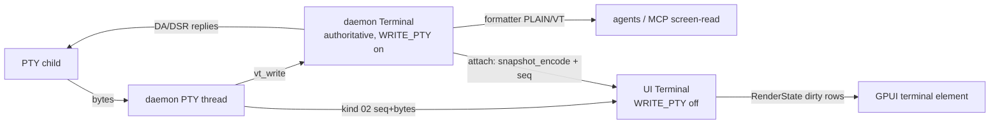

<!-- Research snapshot 2026-09-28. Point-in-time evidence: versions, dates, and activity go stale. /tmp paths mentioned below no longer exist. Decisions derived from this belong in docs/memory/decisions/. -->

# libghostty-vt as dial's terminal emulator (researched 2026-09-28)

Probe host: Apple M5 (10 cores), macOS 27.0 (Darwin 27.0.0), zig 0.16.0 (`/opt/homebrew/bin/zig`), rustc/cargo 1.98.0. Ghostty source: `ghostty-org/ghostty` `main` @ `b40acce58dcf77df52231c3798ea58e924647c89` (2026-09-26). Throwaway probes were in `/tmp/GhosttyVtResearch/` and have been deleted.

## Recommendation

1. **Use upstream libghostty-vt (C ABI) from a pinned Ghostty commit, built by our own build script. Do not use the crates.io `libghostty-vt` 0.2.1 today.**
   - Add a new crate, **`crates/dial-ghostty`**. It is the only crate allowed to contain `unsafe`. It holds checked-in bindgen output (no libclang at build time) plus a small safe wrapper: `Terminal`, `Formatter`, `Snapshot`, `RenderState`, `KeyEncoder`, `MouseEncoder`.
   - Its `build.rs` runs `zig build -Demit-lib-vt -Doptimize=ReleaseFast -Demit-xcframework=false -Dversion-string=<pinned> --prefix $OUT_DIR/…` against a **git submodule `third_party/ghostty` at a pinned rev**. Zig packages are pre-fetched with `zig build --fetch` into the submodule's `zig-pkg/`, so the build script never touches the network.
   - It links the static archive from an isolated directory; see the pitfall under "Linking pitfalls".
   - `dial-term` (no unsafe) wraps it and owns the PTY.
2. **Zig 0.16.x is a hard build requirement on all three OSes.** Ghostty's `requireZig` requires an exact major.minor match: 0.16.0 builds `main`, and 0.15.2 is required for the v1.3.1 tag and for the commit pinned by crates.io `libghostty-vt-sys` 0.2.1. Pin it in CI with `mlugg/setup-zig@v2` `version: 0.16.0`. On Windows, a native Windows host with MSVC Build Tools is required, and those are already required by `*-pc-windows-msvc`.
3. **Architecture:** the daemon keeps one authoritative libghostty-vt `Terminal` per PTY. It feeds that terminal, answers terminal queries (DA/DSR) through `WRITE_PTY`, and serves agent screen-reads via the formatter. It streams **raw PTY bytes** (`kind 02` frames, see `2026-09-28-daemon-ipc.md`) to the UI. The UI runs its own `Terminal` purely for rendering, via the `RenderState` dirty-row API.
   - On attach or reattach, the daemon sends a **`ghostty_snapshot_encode`** blob plus the byte `seq` it covers. The UI decodes the blob and then applies live frames with `seq > snapshot_seq`.
   - Do **not** stream render-state diffs.
4. **PTY:** use **`alacritty_terminal` 0.26 with `default-features = false`, and only its `tty` module**. This is `[DECISION NEEDED]`, because the user dropped alacritty_terminal *for emulation*.
   - It is the only cross-platform candidate that passes dep-review criterion 1 (release ≤12 months). It is Zed-proven on macOS, Linux, and Windows (ConPTY, with a sideloaded `conpty.dll`/OpenConsole when present), and its unsafe code stays inside the dependency.
   - `portable-pty` 0.9.0 **hard-fails criterion 1** (last release 2025-02-11). Its released Windows `kill()` also has an inverted `TerminateProcess` return check, fixed only on the wezterm `main` branch (PR #7709, 2026-06-07).
   - Fallback if the user refuses any alacritty crate: a dial-owned PTY module inside the same unsafe island (rustix `pty` + `windows-sys` ConPTY), roughly 500 LOC of tricky ConPTY code.

## 1. Upstream: where it lives, status, build

- **Sources.**
  - Zig terminal core: `src/terminal/` (`Terminal.zig`, `Screen.zig`, `PageList.zig`, `Parser.zig`, `formatter.zig`, `render.zig`, `snapshot/`, `kitty/`, `osc/`, `search/`, …).
  - C ABI shims: `src/terminal/c/`.
  - Public headers: **`include/ghostty/vt.h`**, which umbrellas `include/ghostty/vt/*.h`. There are 31 headers plus `key/` and `mouse/`, 11,695 lines in total. Note that `include/ghostty.h` is the *full* app-embedding libghostty, not VT.
  - Build logic: `src/build/GhosttyLibVt.zig` and `src/build/GhosttyZig.zig`, with the `-Demit-lib-vt` option in `src/build/Config.zig`. When Ghostty is consumed as a Zig dependency, it defaults to lib-vt-only mode.
  - Zig module: `ghostty-vt`. There are C, Zig, CMake, Swift, and WASM examples in `example/` (30 dirs, for example `c-vt-formatter`, `c-vt-render`, `c-vt-snapshot`, `c-vt-static`, `c-vt-cmake-static`).
- **Status.**
  - Header banner (verbatim): *"WARNING: This is an incomplete, work-in-progress API. It is not yet stable and is definitely going to change."*
  - README (verbatim): *"The functionality is extremely stable … but the API signatures are still in flux."* and *"We haven't tagged libghostty with a version yet"*.
  - The built library self-reports `libghostty-vt.0.1.0.dylib`, with pkg-config `Version: 0.1.0-dev`.
  - Churn: 8 commits touched `include/ghostty/vt` in the last 30 days. One of them was breaking: 2026-08-31 *"set the search needle via ghostty_search_set, drop GhosttySearchOptions"*.
  - The latest app tag, **v1.3.1** (2026-03-13), only has parsers and encoders in `src/terminal/c/` (color, key, osc, paste, sgr). **There is no Terminal, formatter, render, or snapshot API at any tag, so dial must pin a `main` commit.**
- **License:** MIT ("Copyright (c) 2024 Mitchell Hashimoto, Ghostty contributors"). The static archive bundles third-party code:
  - simdutf: Apache-2.0 OR MIT. [UNVERIFIED in-tree: the vendored copy in `pkg/simdutf/vendor` has no LICENSE file.]
  - Google highway: `LICENSE` Apache-2.0 + `LICENSE-BSD3`.
  - wuffs: MIT + Apache-2.0 files, needed for kitty-graphics pixel ops.
  - uucode: MIT.
  - zig compiler_rt.
  - These are **invisible to cargo-deny**. dial must ship their notices manually, for example in an about/licenses screen.
- **Zig version.** `build.zig.zon` `.minimum_zig_version = "0.16.0"` on `main` and "0.15.2" at v1.3.1. `src/build/zig.zig` `requireZig` fails unless `major` and `minor` are equal (and patch ≥). Installed zig 0.16.0 → **compatible with main**; a 0.17 zig would be rejected.
- **Build command and artifacts.** `zig build -Demit-lib-vt -Doptimize=ReleaseFast -Demit-xcframework=false --prefix <dir>` produces:
  - `lib/libghostty-vt.a` (static; on Windows it is named `ghostty-vt-static.lib`, per the libghostty-rs build.rs),
  - `lib/libghostty-vt{.dylib,.so}` (shared),
  - `include/ghostty/vt.h` + `vt/*`,
  - `share/pkgconfig/libghostty-vt{,-static}.pc`.
  - On Windows static builds, the library itself links `ntdll`/`kernel32`, disables the stack protector for MSVC (so no `BufferOverflowU` is needed), and does not bundle ubsan-rt (LNK4229) (`GhosttyLibVt.zig:254-270`).
- **Dependencies.**
  - `-Dsimd=true` (the default) needs libc. The vendored C++ (highway, simdutf) is built with `HWY_NO_LIBCXX`/`SIMDUTF_NO_LIBCXX`, so **no libc++/libstdc++** is needed.
  - Measured: the macOS archive's only external symbols are libSystem ones (`malloc`, `mmap`, `shm_open`, `__ulock_wait`, `sysctlbyname`, …).
  - The Linux `.so` has `NEEDED libm.so.6, libc.so.6, librt.so.1`.
  - `-Dsimd=false` gives a libc-free pure-Zig build with a "significant performance penalty" (comment in `example/c-vt-static/build.zig`).
- **Zig packages fetched at build time** (zig 0.16 stores them in the project-local `zig-pkg/`, 31 MB): uucode, highway, wuffs, oniguruma, iTerm2 themes, test images, translate_c/aro. The URL list is in `build.zig.zon.txt`. Only simdutf, highway, wuffs, and compiler_rt end up in the archive (`ar -t`: `base64 codepoint_width index_of vt wuffs-v0.4 libghostty-vt-static_zcu compiler_rt simdutf abort per_target targets libhighway_zcu`).

## 2. API surface vs dial's needs (header names from `include/ghostty/vt/`)

| Need | Status | API |
|---|---|---|
| Create, free, reset, feed, resize | ✅ | `ghostty_terminal_new(alloc,&t,cols,rows)`, `_free`, `_reset`, `_vt_write`, `_vt_write_until_ground`, `_resize`, plus `_continuation_*` (resume a split escape) |
| Scrollback | ✅ | `OPT_SCROLLBACK_MAX_LINES`/`_MAX_BYTES` (page-granular), `DATA_SCROLLBACK_ROWS`, `_scroll_viewport`, idle `_compress`/`_compression_activity` |
| Cell and row access | ✅ | grid refs (`ghostty_terminal_grid_ref`, `ghostty_grid_ref_cell/_row/_style/_hyperlink_uri`), tracked refs (`grid_ref_tracked.h`), `ghostty_cell_get` (`CODEPOINT`, `HAS_HYPERLINK`, `SEMANTIC_CONTENT`…), `ghostty_row_get` (`WRAP`, `GRAPHEME`, `HYPERLINK`, `SEMANTIC_PROMPT`) |
| Render state with dirty tracking | ✅ | `render.h`: `ghostty_render_state_update` or the split `begin_update`/`end_update` (short lock), global and per-row dirty, `row_iterator_next_dirty`, `row_cells` with graphemes (`GRAPHEMES_UTF8`), styles, selection, cursor, overscan (added 2026-09-25), synchronized-output hold (mode 2026, `OPT_RENDER_HOLD`) |
| Styles and colours | ✅ | `GhosttyStyle` (fg/bg/underline colour: none/palette/rgb; bold/italic/faint/blink/inverse/invisible/strike/overline/underline kind), palette and default colour get/set, `color_scheme.h` |
| Cursor | ✅ | `DATA_CURSOR_X/Y/VISIBLE/STYLE/PENDING_WRAP`, `OPT_DEFAULT_CURSOR_STYLE/BLINK` |
| OSC title, OSC 7 cwd | ✅ | `DATA_TITLE`, `DATA_PWD`, callbacks `OPT_TITLE_CHANGED`, `OPT_PWD_CHANGED` |
| OSC 133 shell integration | ✅ | cell/row semantic content (prompt/input/output), `DATA_CURSOR_AT_PROMPT` (probe: `true` after `ESC]133;A`) |
| OSC 8 hyperlinks | ✅ | `ghostty_grid_ref_hyperlink_uri`, formatter `extra.screen.hyperlink` |
| OSC 52, notifications, progress, bell | ✅ | `OPT_CLIPBOARD_WRITE/READ(_MAX_BYTES)`, `OPT_DESKTOP_NOTIFICATION`, `OPT_PROGRESS_REPORT` (OSC 9;4), `OPT_BELL` |
| Query responses (DA, DSR, XTVERSION) | ✅ | `OPT_WRITE_PTY` callback plus `OPT_DEVICE_ATTRIBUTES`, `OPT_XTVERSION`, `OPT_SIZE`, `OPT_TERMINFO_NAME` |
| Formatter (serialize) | ✅ | `formatter.h`: PLAIN / VT / HTML, `trim`, `unwrap`, optional selection. Extras: palette, modes, scrolling region, tabstops, pwd, keyboard, cursor, style, hyperlink, protection, kitty keyboard, charsets. `format_alloc`/`_buf`/writer |
| Binary snapshot (reattach) | ✅ | `snapshot.h`: `ghostty_snapshot_encode(_alloc/_buf)`, `ghostty_snapshot_decoder_new(_buf)` → `_decode` or incremental `_ready` then `_next` (render first, prepend history later). Format: `"GHOSTSNP"` + u16 version, CRC32C records, includes unfinished parser input |
| Key encoder (kitty protocol) | ✅ | `key/encoder.h`: `ghostty_key_encoder_new/_setopt/_setopt_from_terminal/_encode` (legacy, modifyOtherKeys, kitty flags) |
| Mouse, focus, paste encoders | ✅ | `mouse/encoder.h` (SGR etc., `_setopt_from_terminal`), `focus.h`, `paste.h` (bracketed paste, unsafe-paste detection, kitty clipboard 5522) |
| Selection and search | ✅ | `selection.h` (+ gesture: word/line/drag), `search.h` (scrollback search; API changed 2026-08-31) |
| Kitty graphics | ✅ (optional) | `kitty_graphics.h`, storage limits, medium file/temp-file/shm options, `BUILD_INFO_KITTY_GRAPHICS` |
| tmux control mode | build-dependent | `BUILD_INFO_TMUX_CONTROL_MODE` |
| **PTY / process** | ❌ | none; dial provides it (§6) |
| **Font shaping, glyph raster, GPU renderer** | ❌ | none in lib-vt; dial renders cells with GPUI text |
| Sixel | ❌ | only mentioned in `device.h` (DA reply) |
| IME / preedit | ❌ | UI concern (GPUI input handler) |
| Thread safety | ⚠️ | Not thread-safe per object. `render.h` describes sharing a terminal between an IO thread and a renderer under the caller's lock, and callbacks run on the thread calling `vt_write`. libghostty-rs marks every type `!Send + !Sync` ("the C API is allowed to use thread-local state"). dial should keep each `Terminal` owned by one thread (actor). |

## 3. Rust bindings on crates.io (crates.io API, 2026-09-28)

| crate | latest | date | downloads total / 90d | license | owners | build | notes |
|---|---|---|---|---|---|---|---|
| **`libghostty-vt`** (safe) + **`libghostty-vt-sys`** | 0.2.1 | 2026-07-18 | 137,515 / 128,870 and 44,686 / 37,110 | MIT OR Apache-2.0 | Uzaaft, pluiedev | see below | repo `Uzaaft/libghostty-rs` (390★, last master commit 2026-09-01, 23 open issues, branches pushed 2026-09-27), rust-version 1.90, 427 `unsafe` sites in the safe crate, features `kitty-graphics`, `link-dynamic`, `png`, `log`, `tracing`, `allocator_api` |
| `mnml-libghostty-vt(-sys)` | 0.2.3 | 2026-08-23 | 238 / 258 | — | chris-mclennan | — | single-app fork |
| `khostty-vt` | 0.1.0 | 2026-09-20 | 12 | — | KooshaPari | — | new, negligible use |
| `ghosttea-vt(-sys)` | 0.12.0 | 2026-09-25 | 815 / 869 | — | vibecook-dev | — | "Ghosttea's pinned Ghostty VT core", app-specific |
| `vtcode-ghostty-vt-sys` | 0.123.4 | 2026-06-07 | 2,654 | — | vinhnx | — | app-specific snapshot wrapper |
| `gpui-libghostty` | 0.3.1 | 2026-09-25 | 426 | MIT | — | vendors *full* Ghostty source (3.5 MB crate) | embeds the **full** libghostty native surface (Metal/OpenGL), macOS + Linux-Wayland only, "alpha" → **not usable** (no Windows; a native surface overlay fights the daemon split) |
| `gpui-ghostty` | 0.0.1 | 2026-08-04 | 36 | MIT | prabirshrestha | — | placeholder |
| `libghostty`, `libghostty-sys` | 0.0.0 | 2024-12-24 | ~720 | — | — | — | name squats |

**`libghostty-vt-sys` build (0.2.1 `build.rs`, read in full):**
- The default `vendored` feature **`git clone`s Ghostty at build time** (`--filter=blob:none`, pinned `GHOSTTY_COMMIT = a887df42…`, from 2026-07-11) into `OUT_DIR`, then runs `zig build -Demit-lib-vt=true -Doptimize=<Debug when DEBUG=true, else ReleaseFast> -Demit-xcframework=false -Dapp-runtime=none`.
  - `GHOSTTY_SOURCE_DIR` overrides the source, and `GHOSTTY_ZIG_SYSTEM_DIR` gives offline Zig packages.
  - The `pkg-config` feature is optional.
  - Bindings are checked in (`src/bindings.rs`).
  - Rust→zig target map covers linux gnu/musl, macOS, `x86_64/aarch64-pc-windows-msvc`, windows-gnu, and android.
  - The build script panics on failure (acceptable in `build.rs`).
- **That pinned commit needs zig 0.15.2. With zig 0.16.0 the crates.io release fails.** This was reproduced in Probe C1.
- libghostty-rs `master` (unreleased) pins `22d13172…` (2026-08-06, zig 0.16.0). Its **Windows CI** (`windows-latest`, `x86_64-pc-windows-msvc` and `-gnu`, zig 0.16.0, `cargo build` + `cargo test --lib`, static and `link-dynamic`) was green on master 2026-09-01 and on 2026-09-27 PR branches.
- Verdict for dial:
  - Network at build time is disqualifying.
  - Git deps are disallowed by deny `[sources]`.
  - The release is broken on current zig.
  - `!Send` on everything forces a thread-per-terminal design anyway.
  - Use it as the **reference** for our wrapper; re-evaluate if a release ships with offline/vendored sources.

**How other Rust projects embed it (GitHub search, `libghostty`, language Rust):**
- `nowledge-co/con-terminal` (623★): a **GPUI + gpui-component** terminal. Its crate `con-ghostty` has a `build.rs` that clones Ghostty and runs zig. It builds **libghostty-vt on Windows and Linux** and full libghostty on macOS, and uses `portable-pty` 0.9 on Linux. This is the closest precedent for dial.
- `modu-ai/moai-studio`: GPUI, `libghostty-vt` git rev pin, `portable-pty` 0.9.
- `sadiksaifi/SpaceTerm`: GPUI fork, vendored `third_party/libghostty-vt{,-sys}` path deps, `portable-pty =0.9.0`.
- `frixaco/mightty`: a Windows terminal on libghostty-vt.
- `dindin12138/Husk`: daemon-based Wayland terminal.
- Reverse deps of `libghostty-vt` on crates.io: 12, including `egui_tty`, `ratatui-ghostty`, `scosh`, `phux-protocol`, `agentmux`.

## 4. Source strategy options

| Option | Offline build | Pin control | Windows | Verdict |
|---|---|---|---|---|
| A. crates.io `libghostty-vt` 0.2.1 | ❌ (git clone in build.rs) | theirs (a887df4) | CI-proven on master only | **Reject**: fails on zig 0.16 (proven), network in build |
| B. crates.io release + `GHOSTTY_SOURCE_DIR`=our submodule | ✅ | ours, but checked-in bindings must match *their* commit, and a mismatch is silent UB | same | Reject: ABI mismatch risk |
| C. **Own `dial-ghostty` crate + git submodule `third_party/ghostty` at pinned rev + `build.rs` → `zig build`** | ✅ after `zig build --fetch` into `zig-pkg/` (or `--system <dir>`) | full | needs Windows host + MSVC (§5) | **Recommend** |
| D. Own crate published to crates.io with vendored trimmed source | ✅ | full | same | Later option. Ghostty `src`+`pkg` is 60 MB uncompressed, plus 31 MB of zig packages, against a 10 MB compressed crates.io limit. gpui-libghostty fits full Ghostty in 3.5 MB compressed, so trimming is feasible [INFERENCE]. Not needed while dial is an app, not a library |
| E. build.rs downloads a tarball or prebuilt binaries | ❌ | — | — | Reject (network in build) |

Build-script details for C (measured in §5):
- Pass `-Dversion-string=<pin>`. Otherwise `git describe` changes invalidate the zig cache: a fetch that deepened history forced a 16.7 s rebuild, versus a 0.40 s no-op.
- Always use `-Doptimize=ReleaseFast`, even in the dev profile. Zig Debug is a 21.9 MB archive with safety checks.
- Emit `rerun-if-changed` on the submodule HEAD.
- Check `zig version` and report the required major.minor instead of dumping a comptime error.
- Copy only `libghostty-vt.a` into a clean `OUT_DIR/staticlib` before `rustc-link-lib=static=ghostty-vt`.

## 5. Probes (exact commands and outputs)

**P1: build native (macOS arm64).**
```sh
git clone --depth 1 https://github.com/ghostty-org/ghostty.git   # 3.65 s
zig build -Demit-lib-vt -Doptimize=ReleaseFast -Demit-xcframework=false --prefix /tmp/GhosttyVtResearch/out-native
# real 0m43.938s  (first run: includes fetching zig packages)
```
Artifacts:

| file | size |
|---|---|
| `lib/libghostty-vt.a` | 11,012,992 B (2,554,784 after `strip -S`) |
| `lib/libghostty-vt.0.1.0.dylib` | 1,902,688 B (deps: only `libSystem`) |
| headers | 504 KB |

Rebuild timings:

| rebuild | time |
|---|---|
| fresh `--cache-dir`, packages cached | 33 s |
| no-op | 0.40 s |
| Debug | 24 s (21.9 MB `.a`) |

**P2: raw FFI from Rust 1.98.** Crate `probe-raw` used a `bindgen 0.72` build-dep over `vt.h` and linked the static archive. Its `main` fed `hello \x1b[31mred\x1b[0m\r\n` into a 20×3 terminal. Build time: `Finished release in 6.99s`. Output:
```text
PLAIN: "hello red"
VT:    "hello \u{1b}[0m\u{1b}[38;5;1mred\u{1b}[0m\u{1b}[2;1H\u{1b}[0m"
cell[0,0] 'h' fg=default … cell[0,5] ' ' fg=default
cell[0,6] 'r' fg=palette(1)
cell[0,7] 'e' fg=palette(1)
cell[0,8] 'd' fg=palette(1)
cursor=(0,1)
title="my-title"                  # after ESC]2;my-title BEL
pwd="file://host/tmp/work"        # after ESC]7;file://host/tmp/work BEL
cursor_at_prompt=true             # after ESC]133;A BEL
snapshot bytes=1185
restored PLAIN: "hello red\n$"    # snapshot → decoder_decode → new terminal → formatter
fed 8400000 bytes in 10.6–19.0 ms = 442–791 MB/s   # 100k SGR-coloured lines, 120×40, 4 KiB chunks, 4 runs
scrollback_rows=9673              # SCROLLBACK_MAX_LINES=10000 set
big snapshot bytes=2870549 in 0.9–1.1 ms; decode 3.27 ms, restored scrollback_rows=9673
big VT format bytes=893513 in 2.9–3.6 ms
```
Binary size: 1,703,888 B statically linked vs 435,536 B dylib-linked, so libghostty-vt adds about **1.27 MB**. `otool -L` shows only `libSystem.B.dylib`.

**P2b: PTY → libghostty end to end.** Binary `pty` in `probe-raw`, with `portable-pty =0.9.0` (used only to get bytes; this is not the pick). It ran `sh -c "printf 'hello \033[31mred\033[0m\n'; stty size"` in a 40×5 PTY:
```text
raw pty bytes: "hello \u{1b}[31mred\u{1b}[0m\r\n5 40\r\n"
exit: ExitStatus { code: 0, signal: None }
PLAIN: "hello red\n5 40"
VT:    "hello \u{1b}[0m\u{1b}[38;5;1mred\u{1b}[0m\r\n5 40\u{1b}[3;1H\u{1b}[0m"
```

**C1: crates.io `libghostty-vt = "=0.2.1"` with zig 0.16.0.** It fails after 11 s:
```text
error: failed to run custom build command for `libghostty-vt-sys v0.2.1`
  src/build/zig.zig:13:9: error: Your Zig version v0.16.0 does not meet the required build version of v0.15.2
  thread 'main' panicked at …/libghostty-vt-sys-0.2.1/build.rs:366:5: zig build failed with status exit status: 2
```

**C2: libghostty-rs master** (`git = …, rev = "5988a0b7…"`, probe only; git deps are banned in dial). Cold build: `Finished release in 40.23s`, including its build-time git clone. It uses the safe API: `Terminal::new(20,3)`, `vt_write`, and `Formatter::new(&t, FormatterOptions::new().with_format(f).with_trim(true)).format_alloc(None)`. Output:
```text
Plain: "hello red"
Vt: "hello \u{1b}[0m\u{1b}[38;5;1mred\u{1b}[0m"
cursor=(0, 1)
```

**Cross targets** (`zig build -Demit-lib-vt -Doptimize=ReleaseFast -Demit-xcframework=false -Dtarget=<t>`, fresh cache dir):

| target | result | time | artifacts |
|---|---|---|---|
| `x86_64-linux-gnu` | ✅ | 39 s | `.a` 18.5 MB, `.so` 10.4 MB (with debug_info), NEEDED libc/libm/librt |
| `aarch64-linux-gnu` / `.2.28` | ✅ | 42 s / 32 s | Rust `aarch64-unknown-linux-gnu` probe **linked** with `zig cc -target aarch64-linux-gnu.2.28` → `ELF 64-bit LSB pie executable, ARM aarch64`. No duplicate `compiler_rt`/`compiler_builtins` symbols. **Not executed** (no Linux VM running) |
| `x86_64-macos` | ✅ | 40 s | `.a` 11.9 MB. Rust `x86_64-apple-darwin` probe linked; not run (no Rosetta). `lipo -create` arm64+x86_64 → universal `.a` 22.9 MB, `lipo -info: x86_64 arm64`. Universal = build both, then `lipo` |
| `x86_64-windows-msvc` | ❌ from macOS | 11 s | `error: argument unused during compilation: '-nostdinc++'` / `simdutf.cpp:5:10: error: 'cstring' file not found` / `emmintrin.h:13:10: error: 'stdlib.h' file not found` |
| `aarch64-windows-msvc` | ❌ from macOS | 15 s | same errors |
| `x86_64-windows-msvc -Dsimd=false` | ❌ from macOS | 12 s | `wuffs-v0.4.c:40:10: fatal error: 'stdlib.h' not found` (wuffs is compiled whenever kitty graphics is enabled) |

**Windows story: [UNVERIFIED locally]**
- **Blocker:** Zig ships no MSVC CRT or Windows SDK headers, so an MSVC-ABI build is **native-Windows-host only**. Upstream's own matrix comments out `x86_64-windows-msvc` cross builds: *"doesn't work yet, we need a way to find msvc libc/c++ headers"*.
- **Evidence it works on a Windows host:**
  - Ghostty `test.yml` run 34894281701 (main) shows `build-libghostty-vt-windows` success (`zig build test-lib-vt`, `zig build -Demit-lib-vt`, `example/c-vt-static`) and `Example c-vt-cmake-static (Windows)` success. That build uses Visual Studio/MSVC linking the static lib.
  - `Config.zig` defaults Windows targets to `abi = .msvc` *"so that produced COFF objects (including compiler_rt) are compatible with the MSVC linker … (LNK1143)"*.
  - libghostty-rs Windows CI: `x86_64-pc-windows-msvc` cargo build and test pass (static and dynamic).
- **`aarch64-pc-windows-msvc`:** no CI anywhere, so [UNVERIFIED]. The Rust→zig map exists in libghostty-rs.
- **Needed to prove it:** a Windows (x64 and arm64) CI job that runs dial's `build.rs` + a nextest smoke test.

## 6. PTY crates (crates.io API and RustSec advisory-db clone, 2026-09-28)

| crate | latest / date | dl total / 90d | license, owners | platforms | tokio | criterion 1 (release ≤12 mo) | notes |
|---|---|---|---|---|---|---|---|
| **alacritty_terminal** (`tty` only) | 0.26.0 / 2026-04-06 | 1.71M / 979k | Apache-2.0; chrisduerr + `github:alacritty:publishers` | Unix (`rustix-openpty`, signal-hook SIGCHLD), Windows ConPTY (windows-sys, miow, piper; sideloads `conpty.dll`/OpenConsole from PATH or exe dir) | none. Unix exposes `Pty::file()`/`child()` (usable with a thread or `AsyncFd`); Windows exposes reader/writer pipes and `child_watcher()` | ✅ | `default-features=false`: 29 crates (macOS/Linux), 36 (Windows), 4.1 s release build. Carries unused `vte`/`regex-automata`. `setup_env()` (sets TERM=alacritty) is **opt-in**: don't call it, set TERM via `Options.env`. Zed uses it |
| portable-pty | 0.9.0 / 2025-02-11 | 17.1M / 9.13M | MIT; **wez only** | Unix + ConPTY (+ conpty.dll sideload) | none, blocking `Read`/`Write` boxes | ❌ **hard fail** | API: `resize`, `try_clone_reader`, `take_writer`, `Child::{try_wait,wait,kill,clone_killer,process_id}`. Deps: anyhow, **winapi**, lazy_static, nix 0.28, thiserror 1. Released Windows `kill()` has an inverted `TerminateProcess` check (fix #7709 on `main`, unreleased; `main` also moved to windows-sys 2026-08-25). Used by con-terminal, moai-studio, SpaceTerm, Zeron. Proven in P2b on macOS |
| pty-process | 0.5.3 / 2025-07-12 | 5.25M / 1.37M | MIT | **Unix only** (`std::os::unix`, rustix) | ✅ native | ❌ (14.5 mo) | best Unix tokio API, but no Windows |
| teletypewriter | 2.0.1 / 2026-09-17 | 147k / 75k | MIT; raphamorim only | Unix + ConPTY | own `corcovado` (mio fork) | ✅ | Rio-internal; windows-sys 0.48, `dirs`; single owner |
| winpty-rs | 1.0.6 / 2026-06-10 | 995k / 114k | MIT/Apache | Windows only | — | ✅ | would need a second crate for Unix (one crate per category) |
| rustix-openpty | 0.2.0 / 2025-03-06 | 2.17M / 1.12M | Apache-2.0-LLVM/MIT | Unix only | — | ❌ (small/"done"?) | building block only |
| conpty | 0.7.0 / 2024-09-23 | 592k | MIT | Windows only | — | ❌ | — |

- RustSec: no advisories for portable-pty, pty-process, alacritty_terminal, teletypewriter, conpty, winpty-rs, or libghostty-vt. `nix` has RUSTSEC-2021-0119, patched in ≥0.23, and portable-pty uses 0.28.
- **Pick: `alacritty_terminal` `tty`.** It is the only cross-platform crate passing criteria 1 and 2, and its unsafe stays in the dependency.
  - Integration: one OS thread per PTY owns both the blocking reader and the `!Send` ghostty `Terminal`. It forwards `(seq, bytes)` to tokio via a bounded `async-channel` and receives input and resize commands on another channel.
  - Kill-tree: process groups on Unix, and on Windows a Job Object assigned after spawn. process-wrap cannot spawn into a ConPTY, so on Windows this likely means our own `windows-sys` call inside the unsafe island [INFERENCE].
  - Open question for the user: does "alacritty_terminal is dropped" also forbid its `tty` module? If so, write `dial-pty` inside the unsafe island (rustix `pty` feature + `CreatePseudoConsole`/`ResizePseudoConsole` via windows-sys).

## 7. Architecture fit: daemon Terminal + raw bytes vs render diffs



- **Bandwidth.** Raw bytes are the most compact representation of screen change for normal output: an SGR run costs about 5–10 bytes, while a cell diff needs codepoint + style per cell per dirty row. Measured headroom is large on both sides: IPC at about 1.5 GB/s (daemon-ipc research) and parsing at 442–791 MB/s. Render diffs would need a dial-defined serialized cell format, because `render.h` is an in-process pointer API with nothing to serialize. They would also couple the daemon to each UI's viewport, scroll position, selection, and font metrics.
- **CPU.** The daemon parses every byte once, at about 1.3–2.3 ms/MB. The UI parses again for its own copy. That duplicate parse is cheap compared with glyph layout, and it lets the UI scroll, select, search, and hold on sync-output (mode 2026) locally with no round trip.
- **Latency.** Raw bytes are forwarded as soon as they are read (batched 4–8 ms / 64 KiB per daemon-ipc). Diffs would add a daemon-side render tick.
- **Reattach.** `ghostty_snapshot_encode` of a 120×40 terminal with 9,673 scrollback rows is **2.87 MB, encoded in about 1 ms and decoded in 3.3 ms**. The incremental decoder can render after READY and prepend history later. That beats replaying a 1 MB raw-byte ring, which loses anything older and can split escapes. The VT formatter (0.89 MB, 3 ms) is the fallback when snapshot versions differ. The snapshot carries a u16 format version; daemon and UI ship from the same build, so a mismatch means an old daemon → restart it or fall back to the formatter.
- **Rules.**
  - Only the daemon Terminal sets `OPT_WRITE_PTY`, `OPT_CLIPBOARD_*`, and `OPT_TERMINFO_NAME`. The UI copy must not answer queries, or the child sees duplicate replies.
  - Resize: the UI requests it, the daemon resizes the PTY and its Terminal, then emits a resize marker *in the byte stream at that seq*, so both copies reflow at the same point.
  - Agent screen-read uses daemon-side `Format::Plain`, plus OSC 133 semantic rows to cut command output.

## 8. Unsafe and toolchain policy proposal

- **Island crate `crates/dial-ghostty`.**
  - It holds raw bindings plus the safe wrapper, and is the only crate with `unsafe`. Later it can also hold the Windows Job Object/ConPTY glue, if we write our own.
  - Cargo cannot mix `[lints] workspace = true` with overrides, so it carries **its own full `[lints]` table**: a copy of `[workspace.lints]` with `unsafe_code = "deny"` (not forbid), used with `#![expect(unsafe_code, reason = "FFI to libghostty-vt")]` on the `ffi`/wrapper modules only.
  - It keeps `undocumented_unsafe_blocks` and `multiple_unsafe_ops_per_block` (already workspace-deny).
  - Add an `xtask ci` check that the island's table equals the workspace table except for `unsafe_code`.
  - Workspace `unsafe_code = "forbid"` stays for every other crate. This is in line with the rust-gates research: "put that crate outside the lint inheritance. Don't downgrade the workspace level."
  - Generated bindings: bindgen output lives in `src/ffi/bindings.rs` behind `#[expect(non_camel_case_types, non_upper_case_globals, …, reason)]`. It is regenerated by an xtask on submodule bump, so there is no libclang at build time.
  - The wrapper types are `!Sync`. They can be `Send` only if we verify there is no TLS use in the Zig allocator path [UNVERIFIED]; otherwise they are thread-confined like libghostty-rs.
- **Toolchain requirement.**
  - Zig **0.16.x** (exact minor) on every dev machine and CI runner, via `mlugg/setup-zig@v2` (`version: 0.16.0`).
  - Local installs: macOS `brew install zig` (installed here). [UNVERIFIED] Linux via the official tarball, Windows via winget/scoop or the tarball.
  - Windows also needs the MSVC Build Tools and Windows SDK (already needed for rustc MSVC). Windows builds must run on Windows runners; cross builds from macOS/Linux cannot produce the MSVC-ABI archive (§5).
  - CI adds about 35–45 s cold per target (cache `zig-pkg/` + zig global cache + `target/`), and 0.4 s warm.
  - Record Zig as a documented system build dependency. It is not a cargo dep, so cargo-deny can't see it; keep a row in `docs/memory/deps.md` anyway.
- **Bump procedure.**
  - Update the submodule, run `zig build --fetch`, regenerate bindings, then run nextest on 3 OSes.
  - Expect breaking C API changes; for example, `GhosttySearchOptions` was removed 2026-08-31.
  - Keep a Ghostty license notice and the bundled third-party notices (simdutf, highway, wuffs, uucode) in the app's about screen.

## Open risks
- The C API is unversioned and breaking. Every Ghostty bump is a manual port; pin conservatively and bump deliberately.
- The Windows MSVC link is proven only by third-party CI (x86_64), not by dial. aarch64-windows-msvc has no evidence at all.
- Zig becomes a second compiler toolchain for all contributors, and its exact-minor pin breaks when Homebrew or distros move to 0.17.
- Thread confinement (`!Send`) shapes the daemon: one thread per PTY, or a small pool with per-terminal ownership.
- The PTY pick depends on a user decision about the alacritty `tty` module.

## Sources
- Ghostty repo and files: https://github.com/ghostty-org/ghostty (61,621★, MIT, pushed 2026-09-27). `README.md` §libghostty · `include/ghostty/vt.h` · `include/ghostty/vt/{terminal,formatter,render,snapshot,screen,grid_ref,style,key/encoder,mouse/encoder,build_info,types}.h` · `build.zig.zon` · `build.zig.zon.txt` · `src/build/{Config,GhosttyLibVt,GhosttyZig,zig}.zig` · `example/{c-vt-formatter,c-vt-grid-traverse,c-vt-static,c-vt-cmake-static}` · `.github/workflows/test.yml`
- Ghostty CI run: https://github.com/ghostty-org/ghostty/actions/runs/34894281701
- v1.3.1 lib-vt contents: https://github.com/ghostty-org/ghostty/tree/v1.3.1/src/terminal/c · https://raw.githubusercontent.com/ghostty-org/ghostty/v1.3.1/build.zig.zon
- API docs: https://libghostty.tip.ghostty.org/ · blog: https://mitchellh.com/writing/libghostty-is-coming
- libghostty-rs: https://github.com/Uzaaft/libghostty-rs (`crates/libghostty-vt-sys/build.rs`, `.github/workflows/windows-ci.yml`, runs https://github.com/Uzaaft/libghostty-rs/actions/runs/33512181744) · https://crates.io/crates/libghostty-vt · https://crates.io/crates/libghostty-vt-sys
- crates.io API: `https://crates.io/api/v1/crates?q={ghostty,libghostty,ghostty-vt}`, `/crates/<name>`, `/owners`, `/dependencies`, `/reverse_dependencies` for every crate in §3 and §6
- Embedders: https://github.com/nowledge-co/con-terminal (`crates/con-ghostty/build.rs`) · https://github.com/modu-ai/moai-studio · https://github.com/sadiksaifi/SpaceTerm · https://github.com/behzade/gpui-libghostty · https://github.com/frixaco/mightty
- PTY: https://github.com/wezterm/wezterm/tree/main/pty · https://github.com/wezterm/wezterm/pull/7709 · https://git.tozt.net/pty-process · https://github.com/alacritty/alacritty/tree/master/alacritty_terminal/src/tty · https://github.com/raphamorim/rio
- RustSec: https://github.com/rustsec/advisory-db (crates/ dir listing; `crates/nix/RUSTSEC-2021-0119.md`)
- dial context: `docs/research/2026-09-28-daemon-ipc.md`, `docs/research/2026-09-28-rust-gates.md`, `.omp/skills/dep-review/SKILL.md`, `Cargo.toml` `[workspace.lints]`
