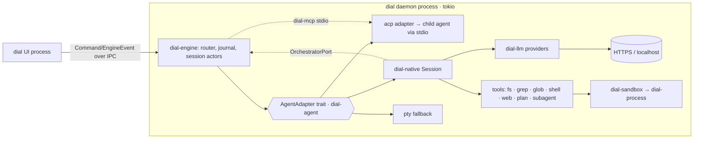

<!-- Research snapshot 2026-09-28. Point-in-time evidence: versions/dates/activity go stale; /tmp paths mentioned below no longer exist. Decisions derived from this live in docs/memory/decisions/. -->

# dial's own native coding agent (Rust): harness design, providers, tools, sandboxing, crates

Research date 2026-09-28. Method:
- **Reference sources.** Shallow clones, read in source: openai/codex @`44fe510` (`codex-rs/`), zed-industries/zed @`d3ccd57` (sparse: `crates/agent`, `acp_thread`, `action_log`, `language_model`, `anthropic`), block/goose @`98c626d`, sst/opencode @`03e6717`. Paths below are repo-relative; the URL prefixes are in [Sources](#sources).
- **Crate facts.** From the crates.io API (`/api/v1/crates/<name>` and `/<ver>/dependencies`). Advisories come from a clone of rustsec/advisory-db @`e211151` (2026-09-25). Repo activity comes from `gh api repos/<r>`.
- **Provider facts.** From the vendors' own docs: Anthropic's `.md` pages, OpenAI and Google docs, and the models.dev `api.json` catalogue.

Anything I could not check directly is marked [UNVERIFIED].

---

## 0. Recommendation (TL;DR)

1. **Shape.** The native agent is **one more adapter behind the same trait as ACP**. It runs in-process in the daemon (engine), on the daemon's tokio runtime, and emits the same `AgentEvent` stream. This is exactly Zed's design: `NativeAgentConnection` implements the same `acp_thread::AgentConnection` trait as external ACP agents, and both feed one `AcpThread` state object ([zd] `crates/agent/src/agent.rs:2193,2769`, `crates/acp_thread/src/connection.rs:91`). Model `AgentEvent` as **upserts keyed by id** (message/tool-call/plan). ACP v2 drafts move in that direction (from the ACP research peer [UNVERIFIED here]).
2. **Crates.** Add **2 crates now** and **1 later**:
   - `dial-llm`: provider wire clients plus normalized stream types.
   - `dial-native`: agent loop, tools, edit engine, context management.
   - `dial-sandbox` (phase 2): the policy model plus per-OS launchers.

   Orchestration (Run/Task/Dispatch/Message/Gate) reaches the native agent through an `OrchestratorPort` trait. The engine implements it. It shares one tool-schema definition with `dial-mcp`, so the native agent and third-party agents see identical orchestration tools.
3. **Providers: hand-rolled typed clients on reqwest 0.13, not a framework crate.** There are four wire formats:
   - Anthropic Messages;
   - OpenAI Responses;
   - Gemini `generateContent`;
   - OpenAI Chat Completions, which covers DeepSeek, Qwen, Kimi, GLM, OpenRouter, Ollama and LM Studio.

   The reason: the harness must keep provider-opaque state losslessly (Anthropic thinking `signature`, Responses `reasoning.encrypted_content`, Gemini `thoughtSignature`, `reasoning_content`) and must control cache breakpoints exactly. Codex and goose both hand-roll their clients on reqwest ([cx] `core/src/client.rs`, [gs] `crates/goose-providers/src/api_client.rs`). **SSE: a hand-rolled framer in `dial-llm`** (the SSE spec is small). eventsource-stream's last release was 2022.
4. **Credentials.** Use `keyring` 4.2 (default `v1` feature: Apple Keychain, Windows Credential Manager, zbus Secret Service). **No subscription OAuth in the native agent.** Anthropic forbids Claude Free/Pro/Max OAuth in third-party products, *including the Agent SDK* ([CC-legal]). Subscription users run Claude Code, Codex and Gemini **through ACP**. The native agent uses API keys, OpenAI-compatible endpoints and local models.
5. **Tool crates.** ripgrep's libraries (`ignore`, `globset`, `grep-searcher`, `grep-regex`) give in-process grep and glob with no `rg` binary dependency. Also `similar` (already proposed), `notify` (already proposed), and `schemars` 1, which is already in the gpui graph, for tool input schemas. **No tokenizer crate**: use provider-reported usage plus a bytes/4 estimate, as codex does ([cx] `core/src/realtime_context.rs:45`).
6. **Edit strategy.** Two formats, chosen per model:
   - Default: `edit` (exact `old_string`→`new_string`, then a bounded fuzzy cascade).
   - OpenAI GPT family: `apply_patch` (codex's freeform grammar).

   opencode switches between them per model ([oc] `tool/registry.ts:297-300`).
7. **Sandboxing, phased. None of the phases needs `unsafe` in dial until Windows.**
   - **P0:** approvals, worktree scoping and a path policy in the file tools.
   - **P1:** macOS `/usr/bin/sandbox-exec -p <profile>` and Linux `bwrap` when installed. Otherwise a Landlock/seccomp self-re-exec helper that uses only safe APIs (`landlock`, `seccompiler`, `CommandExt::exec`).
   - **P2:** Windows restricted token. This needs either a workspace policy change (`unsafe_code` `forbid`→`deny`, plus one `#[expect(unsafe_code)]` module) or a separate helper binary.

---

## 1. Where the native agent sits in dial



**The adapter trait lives in `dial-agent`, as ADR 0005 already plans.** Its shape:

```text
trait AgentAdapter   { fn start(&self, spec: SessionSpec) -> Result<Box<dyn AgentSession>>; fn capabilities(&self) -> AgentCaps; }
trait AgentSession   { async fn prompt(&self, input: Vec<ContentBlock>) -> Result<StopReason>;
                       fn cancel(&self);
                       async fn respond_permission(&self, id: RequestId, decision: PermissionDecision) -> Result<()>;
                       async fn set_config_option(&self, key: ConfigKey, value: ConfigValue) -> Result<()>;   // mode/model/thought_level
                       fn events(&self) -> impl Stream<Item = AgentEvent>; }
```

Notes on the trait:
- `set_config_option` replaces `set_mode`, because ACP v2 drafts fold modes into config options (from the ACP peer [UNVERIFIED here]).
- The ACP adapter translates `session/update` into `AgentEvent`. The native agent emits `AgentEvent` directly. The engine cannot tell them apart. This is the property that lets Zed's UI render native and external threads with one `AcpThread` ([zd] `crates/agent/src/agent.rs:808-810`: the native session builds an `AcpThread` exactly as it would for an external agent).
- Later, `dial-native` can also be served as a **standalone ACP stdio agent** (`dial agent --acp`), so Zed and other ACP clients can use it. goose does this with the official crates (`goose acp`, [gs] `crates/goose-cli/src/cli.rs:851-852`), and so does opencode ([oc] `acp/service.ts`).

**Orchestration as in-process tools.** `dial-native` cannot depend on `dial-engine` (dependency direction), so:
- `dial-core` (or `dial-agent`) defines `trait OrchestratorPort { create_task, dispatch, send_message, open_gate, wait_gate, list_tasks, … }` plus the **tool specs** (name, JSON schema, description) for these operations.
- `dial-engine` implements the port and injects an `Arc<dyn OrchestratorPort>` into each native session.
- `dial-mcp` exposes **the same specs** to third-party agents over MCP. One schema source means the two surfaces cannot drift.
- The subagent tool becomes a **Dispatch of a child Task**. The child can be native *or* any ACP agent in its own worktree. None of the references can do this: codex/Zed/opencode subagents are always the same harness.

---

## 2. Reference harnesses: what they actually do

| Aspect | Codex (`codex-rs`, Rust, Apache-2.0) | Zed native agent (Rust, **GPL-3.0-or-later**) | goose (Rust, Apache-2.0) | opencode (TS, MIT) | Claude Code (closed; docs) |
|---|---|---|---|---|---|
| Loop & cancel | `Op` submission queue → `EventMsg` ([cx] `protocol/src/protocol.rs:590,1358`). Each turn is a tokio task with a `CancellationToken` in an `AbortOnDropHandle` ([cx] `core/src/state/turn.rs:76-81`). `Op::Interrupt` keeps background terminals alive | `Thread::run_turn_internal` streams `LanguageModelCompletionEvent`s → `ThreadEvent`. A `watch<bool>` cancels the turn and cascades to subagents ([zd] `agent/src/thread.rs:2323,2793`) | `Operation` pipeline state machine ([gs] `goose-agent/src/machine.rs:76,158`). `Emitter` carries a `CancellationToken` (`operation.rs:253-269`) | Effect services; `session/prompt` | Esc interrupts; `/rewind` |
| Parallel tools | `ToolCallRuntime` runs calls concurrently. **Parallel-safe tools take a shared `RwLock` read guard, the rest take the write guard** ([cx] `core/src/tools/parallel.rs:50,140,206-208`, `router.rs:237`). Offered only if the model supports it (`client.rs:995`) | `FuturesUnordered` over tool tasks. Tool input streams in, and one malformed call does not block the others ([zd] `thread.rs:2919-2946`) | pre-approved calls are gathered into `tool_futures` and awaited together ([gs] `goose/src/agents/agent.rs`) | ai-sdk multi-tool steps | yes [UNVERIFIED detail] |
| Core tools | `exec_command` + `write_stdin` (PTY "unified exec"), `apply_patch` (freeform), `update_plan`, `view_image`, `web_search`, `spawn_agent`/`send_message`/`wait_agent`/`list_agents`/`interrupt_agent`, `request_permissions`, `request_user_input`, `tool_search`, MCP resources ([cx] `core/src/tools/handlers/`). **No read/grep tools: the prompt says to use `rg`** ([cx] `core/gpt_5_1_prompt.md:284`) | read_file, edit_file, write_file, grep, find_path, list_directory, copy/move/delete/create_directory, terminal, fetch, web_search, diagnostics + LSP tools, ask_user, spawn_agent, skill ([zd] `agent/src/tools.rs`) | "developer" platform extension: shell + text editor (`str_replace`/view/create), exposed as rmcp tools even in-process ([gs] `goose/src/agents/platform_extensions/developer/`, `goose-agent/src/tool.rs:153-156`) | read, write, edit, apply_patch, shell, grep, glob, lsp, webfetch, websearch, todo, task, plan, question, skill ([oc] `tool/`) | Read, Edit, Write, Bash, Glob, Grep, WebFetch, WebSearch, Agent, Task*, LSP, Skill, … On macOS/Linux, **Glob/Grep are dropped by default for embedded `bfs`/`ugrep` inside Bash** ([CC-tools]) |
| Edit format | `*** Begin Patch` / `*** Add/Delete/Update File:` / `*** Move to:` / `*** End Patch` grammar, sent as a **freeform** (non-JSON) tool ([cx] `apply-patch/src/parser.rs:6-40`, `core/src/tools/handlers/apply_patch_spec.rs`). `seek_sequence` matches exact → ignoring trailing whitespace → ignoring both ends ([cx] `apply-patch/src/seek_sequence.rs:1-6`). Has a streaming parser | `edits: [{old_text,new_text}]` applied **while streaming** with `StreamingFuzzyMatcher` and a live diff; failures come back as structured tool output ([zd] `agent/src/tools/edit_file_tool.rs:37-64`, `edit_session.rs`, `edit_session/streaming_fuzzy_matcher.rs:13`) | `str_replace` text editor | replacer cascade: Simple → LineTrimmed → BlockAnchor → WhitespaceNormalized → IndentationFlexible → EscapeNormalized → TrimmedBoundary → ContextAware → MultiOccurrence ([oc] `tool/edit.ts:244-588`). **`apply_patch` replaces edit/write for `gpt-*` models** ([oc] `tool/registry.ts:297-300`) | `Edit`: **exact** `old_string`, must be unique, or `replace_all` ("doesn't use regex or fuzzy matching"). Stale-file edits are allowed if the match is still exact ([CC-tools] "Edit tool behavior") |
| Permissions | `AskForApproval::{UnlessTrusted, OnRequest, Granular, Never}` × `SandboxPolicy::{DangerFullAccess, ReadOnly, WorkspaceWrite{writable_roots,network_access}, ExternalSandbox}` ([cx] `protocol/src/protocol.rs:986-1072`). Starlark `prefix_rule` exec policy ([cx] `execpolicy/src/parser.rs:347`) | `ToolPermissionDecision::{Allow, Deny, Confirm}`; most restrictive wins; path traversal to `.env` forces Deny; per-tool regex `always_allow`/`always_deny`; profiles = tool allowlists ([zd] `agent/src/tool_permissions.rs:207,467-536`, `agent_settings.rs:104,513`) | `GooseMode::{Auto, Approve, SmartApprove, Chat}` ([gs] `goose/src/permission/permission_inspector.rs`) | wildcard rules `ask/allow/deny`, last match wins; reply `once/always/reject` ([oc] `permission/index.ts:26-140`) | modes + allow/deny rules; OS sandbox for Bash ([CC-sandbox]) |
| Sandbox | macOS: `/usr/bin/sandbox-exec` (fixed path, anti-PATH-hijack) + `include_str!` `.sbpl` profiles ([cx] `sandboxing/src/seatbelt.rs:21-62`). Linux: **bubblewrap** (vendored C, also system `bwrap`), `seccompiler` + `PR_SET_NO_NEW_PRIVS`, Landlock only as legacy fallback ([cx] `linux-sandbox/src/landlock.rs:42`). Windows: `CreateRestrictedToken(DISABLE_MAX_PRIVILEGE\|LUA_TOKEN\|WRITE_RESTRICTED)` + private desktop; `Elevated` level = separate sandbox user via a command-runner service ([cx] `windows-sandbox-rs/src/token.rs:21-44,500`, `protocol/src/config_types.rs:297`). Unsafe: 489 `unsafe` occurrences in `windows-sandbox-rs/src`, 94 in `linux-sandbox/src` (grep count) | none (restricted workspace mode disables terminal/fetch) | none | none | Seatbelt on macOS; bubblewrap + socat proxy on Linux/WSL2; **native Windows not supported** ([CC-sandbox]) |
| Undo | legacy `ghost_snapshot` items now deserialize as `Other` ([cx] `protocol/src/models.rs:3798-3802`), i.e. git ghost commits were removed. Isolation is via managed worktrees ([cx] `worktree/src/lib.rs`) | a git checkpoint per user message (`restore_checkpoint`); `ActionLog` keep/reject per buffer ([zd] `acp_thread/src/acp_thread.rs:305,4584,4619`, `action_log/src/action_log.rs`) | — | **shadow git dir** `data/snapshot/<project>/<hash>` with `--git-dir/--work-tree`, sharing object alternates with the real repo ([oc] `snapshot/index.ts:71-75,222-231`) | file checkpoints per prompt; **Bash-made changes not tracked** ([CC-checkpoint]) |
| Compaction | inline auto-compact task, remote compaction variants, `model_auto_compact_token_limit` ([cx] `core/src/compact.rs`, `config/src/config_toml.rs:178`) | `Thread::compact` → summary or provider-native compaction item; live progress events ([zd] `thread.rs:2600,4455-4706`) | threshold 0.8 default ([gs] `goose-context-management/src/lib.rs:32`); max 2 compactions per context error; separate tool-pair compaction | keep recent tail (2k–15k tokens), summarize head, **prune old tool outputs past 40k** ([oc] `session/compaction.ts:28-33`) | auto-compact window; `/compact <focus>`; tool-result clearing ([CC-costs]) |
| Prompt cache | `prompt_cache_key` per thread; Responses `store:false` + `include: reasoning.encrypted_content` ([cx] `core/src/client.rs:575-587,959,997`) | Anthropic top-level `cache_control` + last-block marking ([zd] `anthropic/src/anthropic.rs:726-1000`) | — | via ai-sdk | reports cache hit rate and TTL ([CC-costs]) |
| Providers | Responses only; **Chat wire API removed** ([cx] `model-provider-info/src/lib.rs:96`); ollama/lmstudio via Responses | `LanguageModelProvider::stream_completion` ([zd] `language_model/src/language_model.rs:383`) | hand-rolled `Provider` trait + reqwest `ApiClient` for Anthropic, OpenAI, OpenAI-compatible, Ollama, OpenRouter, Databricks, Vertex, Bedrock ([gs] `goose-provider-types/src/base.rs:474`) | ai-sdk + models.dev ([oc] `provider/provider.ts:148-174`) | Anthropic API / cloud providers |

**Licensing consequence:** Zed's agent crates are GPL-3.0-or-later (`license` field in each `Cargo.toml`), so **study them, do not copy them**. Codex (Apache-2.0) and goose (Apache-2.0) code can be ported with attribution. opencode is MIT.

### 2.1 What makes a harness best-in-class (derived; dial's decision in bold)

- **Tool results are data, not exceptions.** Zed's `AgentTool::run` returns `Result<Output, Output>` so failures are model-readable ([zd] `thread.rs:5180-5262`). **dial: every tool returns a structured `ToolOutput{ok, content, diff?, truncated?}`, and an error string is always something the model can act on.**
- **Edit reliability.**
  - Exact match first. Fuzzy only as a bounded fallback that reports what it did (codex tiers, opencode cascade).
  - Uniqueness required, or `replace_all`.
  - Read-before-edit tracking, with a stale-file check against mtime and hash.
  - Return a unified diff (`similar`).
  - **dial: `edit` with 3 tiers (exact → trailing-whitespace → trimmed/indent-flexible, as in codex `seek_sequence` plus opencode's `IndentationFlexible`), refuse ambiguous matches, and `apply_patch` for GPT models.**
- **Parallel tool calls with a correctness guard.** Codex's RwLock scheme is the simplest correct design. **dial: `ToolSpec::parallel_safe` (reads/grep/glob/web = read guard; edit/write/shell = write guard).**
- **Streaming everywhere.** Stream text, reasoning and tool-input deltas to the UI. Zed even applies edits while `old_text` is still streaming. **dial MVP: stream tool-input to the UI; streamed application is phase 2.**
- **Interruption.** One `CancellationToken` per turn and a child token per tool. Tools poll the token. Shells get kill-tree (process-wrap). Background processes survive a turn interrupt (codex). **dial: same; long-running shells become dial terminals, reusing the daemon's terminal service.**
- **Permission model.**
  - Rule engine: tool × path/command pattern → allow / ask / deny.
  - Most restrictive wins.
  - Mode presets: Read-only / Ask / Auto-in-worktree / Full.
  - Session-scoped "always".
  - **dial: permission requests are `AgentEvent::PermissionRequested` → a journaled Command, the same round-trip as ACP `session/request_permission`.**
- **Checkpoints and undo.** Worktrees already isolate each Task. On top of that, **dial: a per-prompt checkpoint = a commit in a shadow git dir (opencode pattern, `git` CLI) that covers shell-made changes too.** Claude Code's file checkpoints do not cover shell-made changes ([CC-checkpoint]).
- **Context management.**
  - Stable prefix order: system → tools → project rules → history.
  - Anthropic automatic caching (top-level `cache_control`; 4 breakpoint slots; 20-block lookback; 5 m or 1 h TTL, the 1 h TTL at 2× base price) ([A-cache]).
  - Responses `prompt_cache_key`.
  - Prune old tool outputs before summarizing (opencode).
  - Compact at a configurable threshold (goose 0.8), keeping a recent tail.
  - Never drop provider-opaque reasoning blocks inside a turn.
- **Subagents.** Separate context window, restricted tool set, depth limit (opencode `subagent_depth`), cancellation cascade (Zed). **dial: subagent = child Task + Dispatch, so it is journaled, visible in the UI and resumable.**

---

## 3. Provider layer

### 3.1 Wire formats dial must speak

| Wire | Endpoint | Streaming shape | Must-preserve state | Notes |
|---|---|---|---|---|
| Anthropic Messages | `POST /v1/messages` | SSE named events: `message_start`, `content_block_start`/`_delta`/`_stop`, `message_delta`, `message_stop`, `ping`, `error` (e.g. `overloaded_error` mid-stream). Deltas: `text_delta`, `input_json_delta` (partial JSON), `thinking_delta`, `signature_delta` ([A-stream]) | thinking blocks + `signature`, `redacted_thinking` | Caching: automatic top-level `cache_control` or ≤4 explicit breakpoints; 20-block lookback; reads 0.1×, 5 m writes 1.25×, 1 h writes 2× ([A-cache]). Thinking: manual `budget_tokens` is deprecated on 4.6 and **rejected on 4.7+**; use `thinking:{type:"adaptive"}` ([A-think]) |
| OpenAI Responses | `POST /v1/responses` | SSE typed events: `response.created`, `response.output_text.delta`, …, `response.completed`, `error` ([O-stream]) | `reasoning.encrypted_content` items when `store:false` | Codex runs stateless (`store:false`, `include:["reasoning.encrypted_content"]`) with `prompt_cache_key` ([cx] `core/src/client.rs:959,976,997`). A WebSocket transport exists as a beta ([cx] `client.rs:175,1835`) [skip for dial] |
| Gemini | `…/models/{m}:streamGenerateContent?alt=sse` [UNVERIFIED exact path] | SSE of `GenerateContentResponse` chunks | `thoughtSignature` on `functionCall` parts. **Omitting it gives HTTP 400 on Gemini 3**; in parallel calls only the first call carries it ([G-sig], [G-blog]) | An OpenAI-compatible endpoint also exists at `generativelanguage.googleapis.com/v1beta/openai/` ([G-openai]), but the native API is the safer path for signatures |
| OpenAI Chat Completions (compatible) | `POST {base}/chat/completions` | SSE `data:` chunks, `[DONE]` | vendor reasoning field (`reasoning_content` for DeepSeek per models.dev `interleaved.field`) | Codex dropped this wire, but dial needs it for the ecosystem below |

OpenAI-compatible base URLs (models.dev `api.json`, fetched 2026-09-28; 225 providers, 184 of them on `@ai-sdk/openai-compatible`):

| Provider | Base URL | Env var |
|---|---|---|
| DeepSeek | `https://api.deepseek.com` | `DEEPSEEK_API_KEY` |
| Qwen (DashScope) | `https://dashscope-intl.aliyuncs.com/compatible-mode/v1` · CN `https://dashscope.aliyuncs.com/compatible-mode/v1` | `DASHSCOPE_API_KEY` |
| Kimi (Moonshot) | `https://api.moonshot.ai/v1` · CN `https://api.moonshot.cn/v1` | `MOONSHOT_API_KEY` |
| GLM (Zhipu / Z.ai) | `https://open.bigmodel.cn/api/paas/v4` · `https://api.z.ai/api/paas/v4` (coding plan: `/api/coding/paas/v4`) | `ZHIPU_API_KEY` |
| OpenRouter | `https://openrouter.ai/api/v1` | `OPENROUTER_API_KEY` |
| LM Studio | `http://127.0.0.1:1234/v1` | — |
| Ollama | `http://localhost:11434/v1` [UNVERIFIED: not in models.dev; Ollama default port]; Ollama Cloud `https://ollama.com/v1` | `OLLAMA_API_KEY` |
| MiniMax | Anthropic-compatible `https://api.minimax.io/anthropic/v1` | — |

**Model catalogue.** models.dev (sst/models.dev, MIT, 7.0k★, pushed 2026-09-28) carries, per model:
- context and output limits;
- `tool_call`, `reasoning` and `reasoning_options`;
- `interleaved.field`;
- modalities;
- cost.

Recommendation: ship a bundled snapshot and refresh it over HTTP. This replaces hand-maintained per-model quirk tables. opencode is built on the same catalogue ([oc] `provider/provider.ts:13`).

### 3.2 Crate vs hand-rolled

| Crate | Latest | Date | Downloads total / 90d | License | Repo activity | Advisories | Verdict |
|---|---|---|---|---|---|---|---|
| async-openai | 0.42.0 | 2026-09-09 | 8.65M / 2.64M | MIT | 64bit/async-openai 2.0k★, pushed 2026-09-09 | none | OpenAI-only types; optional deps include derive_builder, secrecy, eventsource-stream, tokio-tungstenite. Covers 1 of 4 wires |
| genai | 0.6.5 (0.7 beta) | 2026-06-06 | 420k / 173k | MIT OR Apache-2.0 | jeremychone/rust-genai 0.9k★, pushed 2026-09-27 | none | The best multi-provider fit ("native-protocol", `openai_resp`, `anthropic`, `gemini`, `ollama`, 27+ providers per README). But it is pre-1.0 with one main maintainer, pulls `derive_more`, `strum`, `serde_with`, `value-ext`, and normalizes away control dial needs (breakpoint placement, opaque blocks) [UNVERIFIED depth] |
| rig-core | 0.42.0 | 2026-08-17 | 3.06M / 1.66M | MIT | 0xPlaygrounds/rig 8.7k★ | none | An agent *framework* (its own agent/tool abstractions, `as-any`, `ordered-float`, `futures-timer`…). Conflicts with owning the loop |
| eventsource-stream | 0.2.3 | **2022-02-17** | 24.3M / 10.0M | MIT OR Apache-2.0 | stale | none | Used by codex, genai, rig and async-openai, but unmaintained and on `nom` 7 |
| sse-stream | 0.3.0 | 2026-09-18 | 21.0M / 10.9M | MIT OR Apache-2.0 | 4t145/sse-stream | none | Maintained. It is what **rmcp** uses (`sse-stream ^0.2.4`, optional). Acceptable if rmcp's HTTP client lands anyway |
| reqwest-eventsource | 0.6.0 | 2024-03-29 | 11.4M / 2.36M | MIT OR Apache-2.0 | stale | none | Adds retry semantics dial doesn't want (LLM POSTs are not EventSource GETs) |

**Decision: hand-rolled.** Scope:
- ~4 modules, one per wire, each with serde request/response types and a stream decoder into one internal `LlmEvent` (`TextDelta`, `ReasoningDelta{opaque?}`, `ToolCallStart/ArgsDelta/End`, `Usage`, `Stop`, `ProviderState(blob)`).
- One SSE framer (~150 LoC: `event:`/`data:`/comments/CRLF, multi-line data), fed from `reqwest::Response::bytes_stream()`.
- Retry and backoff for 429/5xx/`overloaded_error`, honouring `retry-after`.

Why not a crate:
- Framework crates would be a **second abstraction for tools and agents**, which one-crate-per-category forbids in spirit.
- async-openai + another crate for Anthropic would be **two crates in the "LLM client" category**.
- goose (the largest Rust agent after codex) reached the same conclusion ([gs] `goose-providers/src/api_client.rs:245-581`, no async-openai).

If `rmcp` is adopted with its HTTP transports, switch the framer to `sse-stream` so the graph keeps one SSE crate.

### 3.3 Credentials and logins

| Crate | Latest | Date | Downloads total / 90d | License | Notes |
|---|---|---|---|---|---|
| keyring | 4.2.0 | 2026-08-29 | 27.5M / 12.0M | MIT OR Apache-2.0 | 4.x is a thin wrapper over `keyring-core` 1.0 plus per-OS store crates. Default feature `v1` = `apple-native-keyring-store/keychain` (security-framework), `windows-native-keyring-store` (windows-sys, Credential Manager), `zbus-secret-service-keyring-store`. MSRV 1.88. No RustSec entries for keyring/keyring-core. security-framework has only RUSTSEC-2017-0003 (old). Codex uses keyring 3.6 with per-OS features ([cx] `keyring-store/Cargo.toml`) |
| zbus-secret-service-keyring-store | 1.0.1 | 2026-08-15 | 1.76M / 1.63M | MIT OR Apache-2.0 | Features `rt-tokio-crypto-rust` / `rt-async-io-crypto-rust` / `*-openssl`. **Pick `rt-tokio-crypto-rust`** (openssl is banned in deny.toml; tokio is the runtime) |

- **Linux headless fallback.** When no Secret Service is running (servers, WSL), fall back to an encrypted-at-rest file or env vars. `linux-keyutils-keyring-store` 1.0.0 is non-persistent across reboots [UNVERIFIED semantics].
- **Subscription OAuth.**
  - Anthropic: forbidden for third-party products ("Using OAuth tokens obtained through Claude Free, Pro, or Max accounts in any other product, tool, or service — including the Agent SDK — is not permitted") ([CC-legal]).
  - OpenAI: ChatGPT/Codex OAuth reuse in third-party apps is not officially supported (secondary source [Puter], [UNVERIFIED primary]).
  - **dial: subscriptions only via the official CLIs over ACP.** The native agent takes API keys, OpenRouter, cloud keys and local servers.
  - An `oauth2` crate is not needed now. The exception is **MCP server OAuth** (rmcp has an `auth` feature, as used by goose [gs] `Cargo.toml:23`), which is a later-phase need.

---

## 4. Tool crates

| Crate | Latest | Date | Downloads total / 90d | License | Repo / activity | Advisories | Use in dial |
|---|---|---|---|---|---|---|---|
| ignore | 0.4.33 | 2026-08-04 | 179.4M / 39.0M | Unlicense OR MIT | BurntSushi/ripgrep | none | gitignore-aware parallel walker (glob, grep, list, file index) |
| globset | 0.4.20 | 2026-08-04 | 245.7M / 53.1M | Unlicense OR MIT | ripgrep | none | glob tool + permission path rules |
| grep-searcher | 0.1.17 | 2026-07-15 | 15.7M / 5.85M | Unlicense OR MIT | ripgrep | none | in-process grep (binary detection, encodings, mmap) |
| grep-regex | 0.1.14 | 2025-10-16 | 14.2M / 5.60M | Unlicense OR MIT | ripgrep | none | matcher for grep-searcher (regex 1.x is already in the gpui graph) |
| similar | 3.2.0 | 2026-08-17 | 205.2M / 52.3M | Apache-2.0 | mitsuhiko/similar | none | unified diffs for edit results and review (already "proposed" in deps.md) |
| notify | 8.2.0 | 2025-08-03 | 160.3M / 39.7M | CC0-1.0 | notify-rs | none | external-change detection (stale-read guard). **Note:** gpui-component depends on `notify ^7`, so choosing 8 duplicates it in the UI binary (the daemon binary would only have 8) |
| schemars | 1.2.2 | 2026-07-27 | 494.4M / 176.8M | MIT | GREsau/schemars | none | `#[derive(JsonSchema)]` tool inputs, as in Zed ([zd] `thread.rs:5180-5262`); already pulled by gpui-pre and the ACP schema crate |
| tiktoken-rs | 0.12.1 | 2026-09-24 | 18.3M / 7.46M | MIT | zurawiki | none | **not recommended.** OpenAI-only vocab. Provider `usage` plus bytes/4 is what codex does |
| diffy / imara-diff | 0.5.2 / 0.2.0 | 2026-08-31 / 2025-06-14 | 16.3M / 32.8M | MIT OR Apache-2.0 / Apache-2.0 | — | none | alternatives to `similar`; one diff crate only |
| tree-sitter | 0.27.0 | 2026-08-30 | 41.2M / 15.2M | MIT | — | none | Phase 3 only: shell-command parsing for exec policy (codex uses tree-sitter-bash for this, [cx] `Cargo.toml`); gpui-kit already has an optional tree-sitter feature |
| starlark | 0.14.2 | 2026-06-05 | 5.90M / 2.60M | Apache-2.0 | facebook | none | codex's exec-policy DSL. **Not recommended**: a TOML/JSON prefix-rule table is enough |

Licenses: all are inside the deny.toml allowlist (Unlicense, CC0-1.0, MIT, Apache-2.0 are listed).

---

## 5. Sandboxing (shell and child processes)

What the references do (§2): codex = Seatbelt / bubblewrap(+seccomp) / Windows restricted token; Claude Code = Seatbelt / bubblewrap+socat proxy, **no native Windows**. Zed, goose and opencode have no OS sandbox.

| Crate | Latest | Date | Downloads total / 90d | License | Notes |
|---|---|---|---|---|---|
| landlock | 0.4.7 | 2026-07-27 | 16.8M / 5.53M | MIT OR Apache-2.0 | Safe API (`Ruleset…restrict_self()`); deps enumflags2, libc, thiserror; landlock-lsm org; no advisories |
| seccompiler | 0.5.0 | 2025-03-07 | 21.5M / 6.51M | Apache-2.0 OR BSD-3-Clause | Safe `apply_filter`. **GitHub repo archived; code moved to the rust-vmm monorepo** (`gh api repos/rust-vmm/seccompiler`: "This is a public archive"). No advisories |
| extrasafe | 0.5.1 | 2024-04-16 | 36k / 9k | MIT | small, stale → no |
| nono | 0.78.0 | 2026-09-16 | 477k / 417k | Apache-2.0 | Cross-platform "capability-based sandboxing (Landlock + Seatbelt)". Pulls keyring 3, sigstore, x509 → too heavy, and a second keyring major |
| hakoniwa | 1.8.0 | 2026-09-25 | 41k / 9k | LGPL-3.0 WITH linking exception | **license not in allowlist**, Linux-only |
| rappct | 0.13.3 | 2025-10-23 | 24k / 18k | MIT | Windows AppContainer toolkit on `windows` 0.62. Young, single-maintainer → evaluate in P2 only |

Unsafe exposure and policy fit (`unsafe_code = "forbid"` today):

- **macOS (no unsafe).**
  - Spawn `/usr/bin/sandbox-exec -p <profile> -- <cmd>` (hard-coded path, as codex does) through tokio::process/process-wrap.
  - Profiles are text templates (deny-default; read-only system; write = worktree + tmp; network on/off).
  - `sandbox-exec` is marked deprecated in its man page but is still what codex and Claude Code use [UNVERIFIED deprecation wording].
- **Linux (no unsafe in dial).**
  1. If `bwrap` is on PATH, use it: `--ro-bind / / --bind <worktree> <worktree> --dev /dev --proc /proc --unshare-net`, etc. This is Claude Code's approach, and it requires the package ([CC-sandbox]). Ubuntu ≥24.04 needs an AppArmor profile for unprivileged userns (documented in [CC-sandbox]).
  2. Otherwise: **self-re-exec helper.** The daemon spawns `dial __sandbox-exec <policy-json> -- argv`. The helper:
     - applies Landlock with the safe `landlock` API;
     - applies seccomp (block `socket(AF_INET*)` when network is off) with the safe `seccompiler::apply_filter`;
     - sets `no_new_privs` (landlock's `restrict_self` sets it by default [UNVERIFIED]);
     - then calls the safe `std::os::unix::process::CommandExt::exec`.

     This avoids `pre_exec` (unsafe) and vendored C, both of which codex needs ([cx] `bwrap/src/main.rs` FFI, `linux-sandbox/src/bundled_bwrap.rs`).
- **Windows (needs unsafe).**
  - Restricted tokens and AppContainer are raw Win32 (`CreateRestrictedToken`, `CreateProcessAsUserW`, ACL edits); codex's implementation has 489 `unsafe` occurrences.
  - Options:
    - (a) change the workspace lint to `unsafe_code = "deny"` and put `#![expect(unsafe_code, reason = "Win32 token FFI")]` on a single `dial-sandbox::windows` module, under a TTSR/lint that forbids it anywhere else;
    - (b) ship the Windows launcher as a separate small helper binary crate with its own lint table [UNVERIFIED: `[lints] workspace = true` is all-or-nothing, so the helper would copy the table minus `unsafe_code`];
    - (c) use `rappct`.
  - Recommend (a) at P2, with a written ADR.
  - Until then, Windows gets approvals + a Job Object kill-tree (process-wrap) + file-tool path policy. That is honest parity with Claude Code, which has no native Windows sandbox.
- **Network.** Phase 3: an allowlist proxy (Claude Code routes sandboxed traffic through a proxy via socat [CC-sandbox]; codex has a `network-proxy` crate [cx]).

Because `dial-sandbox` wraps any `Command`, it can also **sandbox third-party ACP agent processes**, not just native tool calls. That is the main argument for making it a separate crate.

---

## 6. Proposed crate decomposition

Direction stays `proto ← core ← {adapters…} ← engine ← ui ← apps`. New or changed:

| Crate | Layer | Depends on (internal) | Contents | Why its own crate |
|---|---|---|---|---|
| `dial-proto` | proto | — | `AgentEvent` (upsert-by-id), `ContentBlock`, `ToolCallId`, `PermissionRequest`, `SessionConfigOption`; **orchestration tool specs as data** (name, schema JSON, doc) | already exists; shared by UI/engine/MCP |
| `dial-core` | core | proto | reducers; `OrchestratorPort` trait (or in dial-agent) | already exists; pure |
| `dial-llm` **(new)** | adapter | proto (usage/ids only; could be none) | wire types + decoders for Anthropic / Responses / Gemini / Chat-compatible; SSE framer; retry; model catalogue (models.dev snapshot); keyring-backed credential lookup | Largest serde surface; changes on vendor cadence; reusable by the engine for titles, commit messages and summaries without the agent loop; testable with recorded SSE fixtures |
| `dial-native` **(new)** | adapter | proto, core, agent (trait), llm, process, git, sandbox | loop (turn/cancel/parallel guard), tool registry + tools, edit engine (`edit` tiers + `apply_patch` parser), permission evaluator, compaction, checkpoints | The biggest code mass (codex-rs has 153 workspace members with `core` as the hub). Keeps ignore/grep/similar/reqwest out of `dial-agent`'s ACP/PTY tests; parallel compilation |
| `dial-sandbox` **(new, P1/P2)** | adapter (leaf) | proto | `SandboxPolicy{ReadOnly, WorkspaceWrite{roots, net}, Full}` → per-OS `Command` wrapper; Linux helper entrypoint; Windows unsafe module (P2) | Used by both dial-native and dial-agent/acp (sandboxing child agents); the only place unsafe may ever live |
| `dial-agent` | adapter | proto, core, process, term (+ sandbox from P1, to wrap ACP child agents) | the `AgentAdapter`/`AgentSession` trait; `acp/`, `pty/`, `mock/` | as ADR 0005 |
| `dial-engine` | engine | all adapters | registers `NativeAdapter` alongside ACP; implements `OrchestratorPort` | as ADR 0005 |

- **Rejected: a `dial-tools` crate.** No consumer other than dial-native needs the tools. `dial-mcp` exposes *orchestration*, not fs tools.
- **Rejected: native inside `dial-agent`.** It would drag the whole LLM stack into every adapter build.
- **Net: +2 crates now, +1 at P1.**

Workspace dependencies this adds (for `skill://dep-review`): keyring (4, `v1` + zbus `rt-tokio-crypto-rust`), ignore, globset, grep-searcher, grep-regex, schemars (reuse), similar and notify (already proposed), landlock + seccompiler (Linux-only target deps, P1), tokio-util (`CancellationToken`, `AbortOnDropHandle`; 0.7.19, 2026-07-21, 805.8M / 173.9M downloads, MIT, tokio-rs/tokio, no advisories).

---

## 7. Phased roadmap

**MVP: native agent usable for real work (single session).**
- `dial-llm`: Anthropic Messages (streaming, tools, adaptive thinking, automatic caching) and OpenAI Chat-compatible (DeepSeek/Qwen/Kimi/GLM/OpenRouter/Ollama/LM Studio). Keyring API keys.
- `dial-native`:
  - loop with a per-turn `CancellationToken`;
  - parallel tool calls with the read/write guard;
  - tools `read`, `write`, `edit` (exact + 2 fuzzy tiers, uniqueness), `grep`, `glob`, `list`, `shell` (timeout, output cap, kill-tree), `todo`/plan, `ask_user`;
  - orchestration tools via `OrchestratorPort` (`task_create`, `dispatch`, `message_send`, `gate_open`/`gate_wait`, `task_list`; exact names from the glossary).
- Permission rules (allow/ask/deny × tool × glob), with presets per session.
- Worktree scoping for file tools; shell runs with cwd = worktree.
- `AgentEvent` parity with the ACP adapter. Journal replay works for native sessions.
- Compaction v1: prune old tool outputs, then summarize at 80% of context.

**Parity: Claude Code / Codex class.**
- OpenAI Responses (stateless + encrypted reasoning, `prompt_cache_key`) + `apply_patch` tool for GPT models. Gemini native with `thoughtSignature` round-trip.
- Streaming tool-input UI previews; streamed edit application.
- Shadow-git checkpoints per prompt + rewind.
- MCP client (rmcp or hand-rolled, following the dial-mcp decision), so user MCP servers work in the native agent.
- `web_fetch` (reqwest + HTML→text) and provider-hosted web search.
- Subagents = child Task/Dispatch, with depth limit and restricted tools.
- Background shells as dial terminals (`exec` + `write_stdin` style).
- `dial-sandbox` P1: macOS Seatbelt profiles; Linux bwrap / Landlock helper.
- Skills / project rules (`AGENTS.md`) loading.

**Beyond.**
- Windows restricted-token sandbox (policy ADR for unsafe).
- Network allowlist proxy.
- Exec policy with tree-sitter-bash command parsing.
- Serve `dial-native` as a standalone ACP agent.
- Cross-agent subagents: the coordinator picks native vs Claude Code vs Codex per Task.
- LSP diagnostics tool.
- Provider-native compaction (Anthropic/OpenAI server compaction items, as Zed's `CompactionInfo::ProviderNative`).
- Eval harness: replay recorded sessions against new prompts and models.

---

## 8. Risks and open questions

- **Prompt and tool-description quality is most of the "harness" quality**, and it is model-specific (codex keeps per-model prompt files [cx] `core/gpt_5_1_prompt.md`; opencode has `session/prompt/{anthropic,gpt,gemini,kimi}.txt` [oc]). Budget for an eval loop. This is not a one-time write.
- **Provider drift.** Examples: Anthropic rejecting `budget_tokens` on 4.7+ ([A-think]); codex removing the Chat wire ([cx] `model-provider-info/src/lib.rs:96`). Hand-rolled clients need fixture tests per wire and a fast release cadence.
- **Two ways to get an "OpenAI GPT" model.** The ChatGPT subscription goes only through codex-acp. The API key goes to the native agent.
- `notify` 7 vs 8 duplication in the UI binary (gpui-component pins `^7`).
- The Windows sandbox needs an explicit unsafe-policy ADR.
- seccompiler's repo is archived (moved to the monorepo); watch for a new crate name or version.
- The daemon/UI split (goal 6) means the native agent's permission prompts must survive UI detach. Model them as durable Gate-like pending requests in the journal, never as in-memory callbacks.

---

## Sources

Repo URL prefixes:
- [cx] = https://github.com/openai/codex/blob/44fe510ce3ee61c8ef623adcbf89b901c73ddd61/codex-rs/
- [zd] = https://github.com/zed-industries/zed/blob/d3ccd5719486b39b6c18cf37a06233ef9833d6d8/crates/
- [gs] = https://github.com/block/goose/blob/98c626d74b5f0d3d272773f3cabf3252d927d14e/crates/ (except `Cargo.toml` at repo root)
- [oc] = https://github.com/sst/opencode/blob/03e67171ab2dc1e7f16e8cebfbc7f778f61b89f0/packages/opencode/src/

Provider and product docs (fetched 2026-09-28):
- [A-stream] https://platform.claude.com/docs/en/build-with-claude/streaming
- [A-cache] https://platform.claude.com/docs/en/build-with-claude/prompt-caching
- [A-think] https://platform.claude.com/docs/en/build-with-claude/extended-thinking
- [O-stream] https://developers.openai.com/api/docs/guides/streaming-responses
- [G-openai] https://ai.google.dev/gemini-api/docs/openai
- [G-sig] https://ai.google.dev/gemini-api/docs/generate-content/thought-signatures and https://docs.cloud.google.com/gemini-enterprise-agent-platform/models/thought-signatures
- [G-blog] https://developers.googleblog.com/new-gemini-api-updates-for-gemini-3/
- [CC-tools] https://code.claude.com/docs/en/tools-reference
- [CC-checkpoint] https://code.claude.com/docs/en/checkpointing
- [CC-sandbox] https://code.claude.com/docs/en/sandboxing
- [CC-costs] https://code.claude.com/docs/en/costs
- [CC-legal] https://code.claude.com/docs/en/legal-and-compliance (see also https://www.theregister.com/2026/02/20/anthropic_clarifies_ban_third_party_claude_access/)
- [Puter] https://developer.puter.com/tutorials/openai-oauth/ (secondary)
- models.dev catalogue: https://models.dev/api.json · repo https://github.com/sst/models.dev

Crates (crates.io API, 2026-09-28):
- https://crates.io/api/v1/crates/{async-openai,genai,rig-core,eventsource-stream,sse-stream,reqwest-eventsource,keyring,keyring-core,zbus-secret-service-keyring-store,apple-native-keyring-store,windows-native-keyring-store,ignore,globset,grep-searcher,grep-regex,similar,notify,schemars,tiktoken-rs,diffy,imara-diff,tree-sitter,starlark,landlock,seccompiler,extrasafe,nono,hakoniwa,rappct,rmcp,tokio-util}
- Dependency lists: `/api/v1/crates/<name>/<ver>/dependencies`. gpui-pre 0.3.7 and gpui-component 0.7.0 were checked for schemars/regex/notify.

Advisories: https://github.com/rustsec/advisory-db/tree/main/crates. At @e211151, only `rmcp` (RUSTSEC-2026-0189, patched ≥1.4.0, Streamable HTTP server DNS rebinding) and `security-framework` (RUSTSEC-2017-0003) have entries among the crates above.

Repo activity: `gh api repos/<owner>/<repo>`:
- openai/codex 126.8k★, Apache-2.0
- block/goose 54.7k★, Apache-2.0
- sst/opencode 210.5k★, MIT
- zed-industries/zed 91.0k★
- rust-vmm/seccompiler archived
