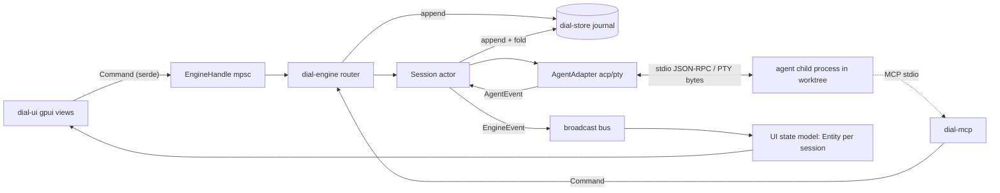

<!-- Research snapshot 2026-09-28 (bootstrap session). Point-in-time evidence: versions/dates/activity go stale; /tmp paths mentioned below no longer exist. Decisions derived from this live in docs/memory/decisions/. -->

# Reference orchestrators: Zeron & Orca → architecture for `dial`

Research date 2026-09-28. All crate numbers from the crates.io API (`/api/v1/crates/<name>`), repo activity from the GitHub API (`pushed_at`), advisories from `rustsec/advisory-db/crates/<name>`. Anything I could not check directly is marked [UNVERIFIED].

---

## 1. Reference apps

### 1.1 Zeron: https://github.com/zeronsh/zeron

- **What it is:** "A native control plane for Claude Code, Codex, Cursor, Devin and other coding agents." Local-first, with optional multi-device sync. MIT, about 2.25k★. Created 2026-07-20, last pushed 2026-09-28. Workspace version 0.2.97.
- **Stack:** Rust edition 2024. The GUI is **gpui**, pinned to the fork `zeronsh/zui` at a fixed git rev, plus `gpui_platform`, `gpui_tokio`, and `gpui-base` (a fork of gpui-component). It does not use Zed's GPL crates (`markdown`, `ui`, `theme`, `editor`). The async runtime is **tokio**. The UI runs engine work through `gpui_tokio`, which surfaces `Tokio::spawn` futures as gpui `Task`s. The sync edge is a TypeScript Cloudflare Worker with Durable Objects. There is also an iOS app.
- **Topology** (from `ARCHITECTURE.md`): `gpui UI ─ in-proc/localhost RPC ─ engine`.
  - The **Engine** is the backend. It runs agents, terminals, repos and worktrees, diff sync, auth, and doc hosting. It is a pure Rust daemon and works fully headless.
  - The **UI** is only a viewport. It uses the same typed RPC whether the engine is in-process (an in-memory duplex, "zero serialization shortcuts, so the boundary stays honest") or a separate daemon. `zeron` runs headed; `zeron headless` runs the engine only. When headed, the app also serves its embedded engine on the IPC port so other viewports can attach.
- **Cargo workspace** (`Cargo.toml` members): `crates/{theme, proto, preview, doc, sync, harness, engine, rpc, update, ui, syntax, markdown, mobile, client, mcp, text}` plus `apps/zeron`.
  - `zeron-proto`: wire types (`AgentEvent`, `ToolCall`, `RunRequest`, RPC envelopes; serde with ndjson framing) and `view`, the pure derivations both frontends share (sort orders, grouping, gating).
  - `zeron-doc`: Loro CRDT schemas for the session doc and workspace registry, plus a mirror layer.
  - `zeron-sync`: Loro room client, plus `DocsStore` (SQLite snapshots and a processed-command ledger).
  - `zeron-harness`: the `Harness` trait and its adapters (`acp/`, `claude/`, `codex/`, `cursor/`, `opencode/`, `mock.rs`, `jsonrpc.rs`, `process.rs` with a Windows job/escrow submodule, `adapter_install.rs`).
  - `zeron-engine`: `sessions.rs`, `run_journal.rs`, `doc_host.rs`, `repos.rs`, `diff_sync.rs`, `terminals.rs` (portable-pty), `workspace_files.rs`, `instance_lock.rs`, `agent_accounts/`, `rpc.rs`.
  - `zeron-rpc`: typed request/response/stream over WebSocket (tokio-tungstenite), plus an in-memory transport.
  - `zeron-mcp`: a hand-rolled stdio MCP server that proxies to engine IPC. It is injected into agents so they can message other chats (see below).
  - `zeron-ui`: the gpui shell.
- **How agents are spawned** (`docs/research/harness.md`, then `docs/research/acp.md`):
  - First generation spoke to each CLI directly:
    - Claude: `claude -p --output-format stream-json --input-format stream-json --verbose --include-partial-messages`, with a `control_request`/`control_response` channel for permissions, interrupt, and model.
    - Codex: `codex app-server`, JSON-RPC 2.0 over stdio.
  - **2026-08-08 decision: everything moved to ACP (Agent Client Protocol v1).** The claude and codex adapters are now `@agentclientprotocol/claude-agent-acp` (pinned 0.66.0) and `@agentclientprotocol/codex-acp` (pinned 1.1.14). Native ACP agents are Grok (`grok agent stdio`), Hermes (`hermes acp`), Devin (`devin acp`), and Pi via `pi-acp`. Converting deleted about 4,300 lines of bespoke adapters.
  - The ACP wire is **hand-rolled tolerant serde verified against `agent-client-protocol-schema` 1.3.0**, not the SDK crate. The reason given: Zeron keeps its own child-lifecycle hardening (StderrTail, SIGTERM→SIGKILL, PATH composition) and needs raw updates that the SDK's `ActiveSession` abstraction hides.
  - Protocol calls used:
    - `initialize` (protocolVersion 1; fs/terminal client capabilities declined)
    - `session/new` / `session/load`
    - `session/prompt`; its response carries `stopReason`
    - `session/cancel`, then SIGTERM/SIGKILL if needed
    - `session/update` notifications, mapped to `AgentEvent` (text/thought chunks, `tool_call`/`tool_call_update` with diffs, `plan`, `available_commands_update`)
    - `session/request_permission`: auto-allow; question-shaped requests go to the input panel
    - `session/set_config_option` for model and `thought_level`
    - the `_session/steering` extension when advertised, otherwise steering is delivered at the turn boundary
  - Adapters are installed once into `~/.zeron/adapters/<pkg>/<version>` and launched as `node <entry>`. They moved off `npx` because of npm errno exit codes and cold-start stalls.
- **Normalized event model** (`crates/proto/src/agent.rs`): `AgentEvent::{SessionStarted{harness, model, tools, cwd, session_id, assistant_message_id}, TextDelta, ReasoningDelta, GeneratedImage, AssistantMessageCompleted, ToolCall{id, call}, ToolResult{id, is_error, output?, diff?}, ContextUsage, Usage, AvailableCommands, Error, InputRequested{request_id, questions}, …}`. Tool calls are decoded into typed variants (Exec, ReadFile, …).
- **Isolation:** git worktrees under `~/.zeron/worktrees`. Git work shells out to the `git` subprocess ("matches zeron, avoids libgit2 edge cases"). File watching uses `notify` plus a 2-minute repair pass. Diff capture is patch + numstat + untracked, capped at 3 MiB and hashed with sha256. There is no OS sandbox; sandbox policy belongs to the agent adapter.
- **State and persistence:**
  - **Loro CRDT docs.** A per-chat session doc holds the transcript plus a durable command queue. A per-profile workspace registry doc holds spaces, the chats index, devices, and status.
  - Snapshots are stored in **SQLite (rusqlite 0.32, bundled)**.
  - An **on-disk run journal** gives resumable `seq` replay and crash auto-resume.
  - **Command plane:** send, steer, interrupt, and respondInput are durable command entries in the doc, executed by the host device. Entries are marked processed *before* execution, which makes them idempotent.
  - Profiles live under `{data_dir}/profiles/local/` or `{data_dir}/orgs/{org}/{user}/`.
- **UI concepts:**
  - The sidebar is an attention-sorted Sessions list filtered by "spaces" (device + folder pairs).
  - Horizontal tabs are a device-local viewport over that list; closing a tab does not archive the session.
  - The transcript is a virtualized gpui `list()` with bottom alignment and block-granularity rows.
  - The composer supports Send→Steer→Stop, a question panel, and pickers for harness/model, repo, and branch+worktree.
  - The terminal pane uses `alacritty_terminal` + `portable-pty`, with a custom gpui grid element.
  - The diff pane is a unified-patch parser feeding virtualized file/hunk/line rows.
- **Inter-agent communication:** `zeron mcp` is a stdio MCP server that the engine injects into an agent's MCP config, with `ZERON_CHAT_ID` and `ZERON_DEVICE_ID` in the environment. Agents call tools that go through engine IPC to message or drive other chats. Messages are attributed to the originating chat, and a chat cannot message itself.
- **Useful dependency choices from its workspace:** tokio 1, tokio-util, serde/serde_json, rusqlite (bundled), thiserror 2 + anyhow 1, tracing, clap 4, notify 7, portable-pty 0.8, alacritty_terminal 0.26, similar 2 (diffs), pulldown-cmark, reqwest (rustls), ignore, nucleo-matcher, uuid, loro 1.13.

### 1.2 Orca: https://github.com/stablyai/orca (the right "Orca")

It is identified by its README tagline "Run Codex, ClaudeCode, OpenCode or Pi side-by-side — each in its own worktree". The docs are at https://www.onorca.dev/docs. MIT, about 79.9k★, created 2026-03-17, last pushed 2026-09-28, `package.json` version 1.4.214. (`fmfsaisai/orca`, a tmux + skills orchestrator, is a different and much smaller project.)

- **What it is:** an "ADE" (agent development environment) for running a fleet of parallel CLI agents. Every task gets its own git worktree, agent terminal(s), and browser tab. It supports 30+ CLI agents under the principle "if it runs in a terminal, it runs in Orca". It has desktop, mobile companion, and remote runtime targets.
- **Stack:** **Electron + TypeScript + React.** `src/{main, preload, renderer, shared, cli, relay}`. Relevant npm dependencies:
  - `node-pty ^1.1.0` for PTYs
  - `@xterm/headless` + `@xterm/addon-serialize` for terminal state and scrollback serialization
  - `@anthropic-ai/claude-agent-sdk`
  - `ssh2` for SSH worktrees
  - `ws`, `zod`, `@parcel/watcher`, `yaml`, `electron-updater`, `@linear/sdk`
  - SQLite through `src/main/sqlite/` (bun/node sqlite)
- **How agents are spawned:**
  - **Primarily as TUIs in a PTY.** Each agent CLI runs interactively in a terminal pane (xterm.js, WebGL rendering, kitty keyboard protocol, OSC 133). The code tree has per-agent modules in `src/main/{claude, codex, cursor, gemini, grok, hermes, opencode, pi, devin, …}`.
  - **Terminal daemon:** PTYs live in a separate long-lived daemon (`src/main/daemon/`, 272 files) that survives app restarts. It has a strict socket-endpoint ownership protocol (`src/main/daemon/AGENTS.md`), cold-restore replay, and persisted scrollback.
  - **Status detection:** "Agent status hooks" are Orca-managed hooks installed into agent configs. They report working / waiting / done to the app over HTTP, with the endpoint written to `{userData}/agent-hooks/endpoint.env`. Status is also inferred from terminal titles (`terminal-title-agent-type`, the synthetic title spinner).
  - **"Chat UI (native chat)"** (experimental) is a structured transcript and composer layered over the *same PTY*: "The terminal remains the source of truth". It decodes transcripts for Claude, Codex, Grok, and OMP, and has an agent session journal (`src/main/native-chat/agent-session-journal/`).
  - **Hibernation:** idle finished agents are stopped and later relaunched with resume flags (`claude --resume <id>`, `codex resume <id>`).
- **Isolation:** worktree-native, following https://www.onorca.dev/docs/model/worktrees.
  - Each repo has a base ref (usually `origin/main`). Each worktree has a start-from ref, its own branch, its own files, and its own terminals.
  - The lifecycle is Create → Work → Review (diff vs start-from, annotate) → Ship (commit/push/PR/checks) → Archive/Delete.
  - `git fetch` + `git worktree add` run in the background with a progress row.
  - Gitignored state reaches a new worktree three ways: per-repo "Worktree Shared Paths" (APFS clone or symlink), `orca.yaml` `worktree.sharedDirectories` (symlink), and `.worktreeinclude` (copy, literal paths only).
  - Setup hooks such as `pnpm install` run after create.
  - SSH/remote worktrees are supported, as are ephemeral VMs.
  - Orca uses **plain git**: "Every Orca worktree is a real git worktree."
- **State and persistence:** a large persistence layer in `src/main/persistence*` with atomic "durable file write", migrations, and pane/tab identity. SQLite is used for journals, terminal scrollback snapshots, and session history.
- **UI concepts:**
  - The sidebar groups worktrees by project and supports filters (sleeping, default branch, CLI-created, …), pin, multi-select, nesting (parent/child workspaces), and a Cmd-J jump palette.
  - Inside a worktree: infinite terminal splits and tabs, a Monaco editor, a built-in Chromium browser with Design Mode, the diff view with "Annotate AI Diffs" (line comments sent back to the agent), GitHub/Linear/Jira/GitLab task panels, a status bar with agent activity, notifications, and unread state.
- **Inter-agent communication:** the **Orca CLI** (`src/cli`). Agents run `orca …` from inside their PTY to drive the app, for example `orca worktree create`, `orca terminal send`, and `orca terminal wait --for tui-idle`. Structured orchestration is at https://raw.githubusercontent.com/stablyai/orca/main/docs/site/content/docs/cli/orchestration.mdx:
  - **Run:** a durable namespace plus a coordinator inbox.
  - **Task:** has a spec and deps; status is `pending|ready|dispatched|completed|failed|blocked`.
  - **Dispatch:** one attempt of a task on a terminal; it is the authority for `worker_done` and heartbeat.
  - **Message types:** `status|dispatch|worker_done|escalation|question|heartbeat`.
  - **Decision gate:** a coordinator-owned blocking question.
  - Commands: `orca orchestration run-create | task-create | worker-start --task <id> --worktree current|new-child --agent codex | check --wait --types worker_done,escalation,question | send --type worker_done --task-id --dispatch-id --outcome succeeded|failed | ask | gate-create/resolve`.
  - Group addresses: `@all`, `@idle`, `@claude`, `@worktree:<id>`.
  - A worker preamble is injected into dispatched agents, and delivery is FIFO with explicit ack.

### 1.3 Side-by-side

| Aspect | Zeron | Orca |
|---|---|---|
| Language/GUI | Rust + gpui (fork) | TypeScript + Electron/React |
| Agent integration | **Structured**: ACP JSON-RPC over stdio (earlier stream-json / codex app-server) | **TUI in PTY** (node-pty + xterm), status via injected hooks; experimental transcript decoding |
| Process host | Engine daemon (in-proc or separate), typed RPC | PTY daemon surviving restarts |
| Isolation | git worktrees (`git` subprocess) | git worktrees (`git` CLI), shared-dir symlinks, setup hooks, SSH/VM |
| Persistence | Loro CRDT docs + SQLite snapshots + run journal | JSON/durable files + SQLite journals + scrollback snapshots |
| Inter-agent | MCP server (`zeron mcp`) injected into agents → engine | CLI (`orca orchestration …`) called from agent shells; Run/Task/Dispatch/inbox |
| Review | diff pane (unified patch, virtualized) | diff view + line annotations back to agent, PR/checks inline |

---

## 2. Distilled architecture for `dial` (Rust + gpui/gpui-kit)

### 2.1 Principles taken from both apps

1. **An engine/UI split with a typed boundary** (Zeron). The engine is a headless library and binary. The UI is a pure viewport over engine state. Start in-process (channels), but keep all traffic as serializable messages so a daemon or remote mode is a transport swap later.
2. **Structured agent protocol first, PTY second.** Use **ACP** for agents that support it (Claude via the claude-agent-acp adapter, Codex via codex-acp, Gemini CLI, Cursor, Copilot, OpenCode, Goose, Kimi, Qwen, Hermes, Pi, Junie, … per https://agentclientprotocol.com/get-started/agents). This gives typed tool calls, diffs, permissions, cancel, and model config. Keep a **PTY "terminal agent" adapter** for arbitrary TUIs (Orca's universality) and for user shells.
3. **A worktree per task** via the `git` CLI (both apps do this). Plan for setup hooks and gitignored-file materialization (`.worktreeinclude`-style copy list, symlinked shared dirs).
4. **An append-only event journal per session** is the source of truth. UI state is a fold (projection) over events. That gives crash recovery, replay, and resume (Zeron's run journal and mark-processed-before-execute command ledger).
5. **Orchestration as a first-class domain,** not ad-hoc prompts. Borrow Orca's Run/Task/Dispatch/Message/Gate model. Expose it to agents through an **MCP server** that `dial` injects into each agent session (the Zeron approach; typed and discoverable, with no shell-parsing needed). ACP `session/new` accepts `mcpServers`, so it can be injected per session.

### 2.2 Recommended workspace layout

```
dial/
  Cargo.toml                 # [workspace], [workspace.dependencies], [workspace.lints]
  crates/
    dial-proto/      # pure data: ids (SessionId, TaskId, WorktreeId…), AgentEvent, ToolCall,
                     # Command (UI→engine), EngineEvent (engine→UI), serde; no I/O
    dial-core/       # domain + orchestration: Workspace/Repo/Worktree/Session/Run/Task/
                     # Dispatch/Message/Gate state machines; reducers `fn apply(state, event)`;
                     # pure, fully unit-tested with nextest
    dial-agent/      # AgentAdapter trait + adapters:
                     #   acp/   (JSON-RPC 2.0 ndjson over child stdio; types from
                     #           agent-client-protocol-schema)
                     #   pty/   (generic TUI agent in a PTY; status via hooks/idle heuristics)
                     #   mock/  (scripted adapter for tests)
    dial-process/    # child spawn/kill-tree (process groups / Windows Job Objects), stderr tail,
                     # PATH/env composition, graceful SIGTERM→SIGKILL escalation
    dial-term/       # PTY + terminal emulation (alacritty_terminal: tty + Term grid), resize,
                     # scrollback snapshot; exposes grid snapshots to UI
    dial-git/        # `git` CLI wrapper: worktree add/list/remove/prune, status --porcelain=v2,
                     # diff/numstat, commit, branch; typed output parsers; worktree setup hooks
    dial-store/      # SQLite: event journal (append-only), projections cache, settings, migrations
    dial-mcp/        # stdio MCP server exposing orchestration tools to agents (dispatch, send,
                     # ask, worker_done, task list) → engine via in-proc/IPC channel
    dial-engine/     # composition root: actors per session/terminal/worktree, command router,
                     # event bus (broadcast), recovery on start, watchdogs
    dial-ui/         # gpui + gpui-kit views: sidebar (workspaces/worktrees/sessions), session
                     # pane (transcript + composer), terminal pane, diff/review pane, task board
  apps/dial/         # binary: builds engine + UI; `dial` (headed), later `dial headless`/`dial mcp`
```

Dependency direction: `proto ← core ← {agent, git, term, store, mcp} ← engine ← ui ← apps/dial`. `dial-ui` depends only on `proto` + `core` (view models) and an `EngineHandle`, never on adapters.

### 2.3 Data flow



1. A **UI event** (click "Send", "New task") creates a `Command` (e.g. `Prompt{session, text}` or `CreateWorktree{repo, base, name}`) that goes to the engine over a bounded channel.
2. The **engine router** validates the command against `dial-core` state, appends it to the journal (the durable intent), and routes it to the owning actor: the session, terminal, or git worker.
3. The **session actor** calls the adapter. For ACP that means `session/prompt`; for PTY it writes bytes to the pty.
4. **Adapter events** (`session/update` notifications, PTY output, exit) are normalized to `AgentEvent`, appended to the journal, and folded into the session projection.
5. **`EngineEvent`s** go out on a broadcast bus. The UI bridge applies them to gpui `Entity` models on the foreground executor and calls `cx.notify()`. Coalesce token deltas (Zeron uses about 120 ms commits) to avoid re-rendering on every token.
6. **Permission and question requests** (`session/request_permission`) become UI prompts. The UI's answer is a `Command` that the actor forwards as the JSON-RPC response.
7. **Recovery at startup** replays the journal into projections, marks runs that were in flight as `aborted`, and offers resume via `session/load`.

**Runtime bridging:** gpui has its own executors. Put the engine on its own **tokio** runtime thread and connect it to gpui through channels (or `gpui_tokio`, which Zeron uses via its fork). [UNVERIFIED] whether gpui-kit ships a tokio bridge; see the GpuiKitResearch report.

### 2.4 Protocols worth adopting

- **Agent Client Protocol (ACP):** https://agentclientprotocol.com, JSON-RPC 2.0 over stdio.
  - `agent-client-protocol` (SDK): **2.2.0**, released 2026-09-18. Previous releases: 2.1.0 (09-04), 2.0.0 (07-23). About 4.7M downloads total, 1.8M in the last 90 days. Apache-2.0, MSRV 1.88. Repo `agentclientprotocol/rust-sdk`, pushed 2026-09-25. crates.io owners are `benbrandt` and `agu-z` (Zed Industries) plus the `github:agentclientprotocol:rust-maintainers` team. Zed itself pins `agent-client-protocol = { version = "=2.2.0", features = ["unstable"] }`. No RustSec advisories.
  - **Caveat:** 2.2.0 has runtime dependencies on `async-io`, `async-process`, `blocking`, and `futures-concurrency`, which are smol-family I/O and process crates. If `dial` standardizes on tokio, that means a **second async I/O stack**, which conflicts with the one-runtime rule.
  - `agent-client-protocol-schema` (types only): **1.9.1**, released 2026-09-18. Depends on serde, serde_json, serde_with, strum, derive_more, anyhow, and optionally schemars/tracing. It has feature flags for `unstable_*` (session_fork, mcp_over_acp, …).
  - **Recommendation:** use `agent-client-protocol-schema` for wire types and write a small tokio JSON-RPC stdio driver in `dial-agent/acp`. This is exactly what Zeron did ("hand-rolled … verified against agent-client-protocol-schema"). It keeps one runtime, gives full control of child lifecycle, and keeps the no-panic policy inside our own code. Revisit the full SDK if it adds tokio support. Pin the schema version exactly (`=1.9.1`) because it moves quickly.
- **MCP** (for agents → dial orchestration tools):
  - `rmcp` **3.5.0**, released 2026-09-28. Official `modelcontextprotocol/rust-sdk`. About 29.7M downloads, 15.5M in the last 90 days. Apache-2.0, tokio-based.
  - Alternative: hand-roll the five-method stdio server (`initialize`, `ping`, `tools/list`, `tools/call`, `notifications/initialized`) as Zeron did, with zero new crates.
  - Pick: **rmcp** if more of the MCP surface is needed; hand-rolled if only tool calls are needed. Decide once in `dial-mcp`.
- **Orchestration message model** (from Orca, adapted as `dial-core` types): `Run`, `Task{status: Pending|Ready|Dispatched|Completed|Failed|Blocked, deps}`, `Dispatch` (one attempt; completion authority), `Message{kind: Status|Dispatch|WorkerDone|Escalation|Question|Heartbeat}`, `Gate`. `worker_done` must carry `task_id` and `dispatch_id` so stale retries cannot complete the wrong dispatch. Deliver FIFO with explicit ack.

---

## 3. Crate picks (one per category)

Figures come from the crates.io API as of 2026-09-28: `latest` is the newest version and its date; downloads are total and last 90 days; activity is the GitHub `pushed_at`.

| Category | **Pick** | Evidence | Rejected (why) |
|---|---|---|---|
| Async runtime | **tokio** 1.53.1 | 2026-07-20; 1.0B / 234M; MIT; used by Zeron; rmcp and process-wrap are tokio-native | smol/async-std: second ecosystem |
| Agent protocol types | **agent-client-protocol-schema** 1.9.1 (pin `=`) | 2026-09-18; 5.1M / 2.1M; Apache-2.0; official ACP repo; no advisories | `agent-client-protocol` 2.2.0 SDK: pulls async-io/async-process (second runtime); fine if the team accepts it |
| PTY + terminal emulation | **alacritty_terminal** 0.26.0 | 2026-04-06 (0.25.1 was 2025-10-18); 1.7M / 976k; Apache-2.0; MSRV 1.85; repo pushed 2026-08-31, 65.8k★; no advisories. Provides both `tty` (Unix openpty via `rustix-openpty`, Windows ConPTY via `windows-sys`/`miow`) and the `Term` grid/`vte` parser. **Zed's terminal uses exactly `alacritty_terminal::{tty, event_loop::EventLoop, term::Term}`** (`crates/terminal/src/alacritty.rs`, on a Zed fork rev). Modern dependency set (bitflags 2, rustix 1, windows-sys 0.59). | `portable-pty` 0.9.0: last release 2025-02-11 (19 months ago), old dependencies (winapi 0.3, bitflags 1, nix 0.28, lazy_static), though its wezterm repo is active and Zeron uses it. `pty-process` 0.5.3: Unix-only. `vt100`: emulation only, less complete |
| Child process mgmt (non-PTY agents, ACP stdio) | **tokio::process** + **process-wrap** 10.0.1 | process-wrap 2026-09-23; 15.5M / 7.3M; MIT/Apache; watchexec org, pushed 2026-09-28; no advisories. Gives process groups/sessions on Unix and Job Objects on Windows for kill-tree | `command-group` 5.0.1: superseded by process-wrap, last release 2023-11 |
| Git | **`git` CLI subprocess** (via dial-process), typed parsers in `dial-git` | Both Zeron ("avoids libgit2 edge cases") and Orca shell out. Full worktree lifecycle, user hooks, credential helpers, config, and LFS all behave exactly like the user's git. Needs a minimum-version check at startup. | `git2` 0.21.0 (2026-05-18, 116M dl): libgit2 C dependency; 3 "unsound" RustSec advisories in 2026 (RUSTSEC-2026-0008/-0183/-0184, patched ≥0.21.0) plus older libgit2-sys ones; worktree/hook/credential parity gaps. `gix` 0.88.0 (2026-09-25, very active, pure Rust): per `crate-status.md` it can create linked worktrees but **not "move, remove, and repair linked worktrees"**, and **checkout/switch/reset and stash are unchecked**, so it cannot own the lifecycle. Past advisories (gix-features RUSTSEC-2025-0021, gix-path 2024 ×3) are fixed. Revisit gix later only for hot read paths (status/diff) if profiling demands it. |
| Text diff (UI diff/hunks) | **similar** 3.2.0 | 2026-08-17; 205M / 52M; Apache-2.0; mitsuhiko; Zeron uses it | — (for git diffs, parse `git diff` output; use `similar` for in-app line diffs) |
| Persistence | **rusqlite** 0.40.2 with `bundled` | 2026-08-08; 113M / 36M; MIT; repo pushed 2026-09-25; advisories are only old (2020/2021, long patched). Sync API behind a dedicated store thread; SQL fits an event journal plus queries (task board filters, session history). Zeron uses rusqlite; Orca and Zed (`sqlez`) use SQLite too. | `sqlx` 0.9.0: async, heavy, compile-time DB macros, MSRV 1.94; overkill for embedded single-user. `redb` 4.3.0: excellent pure-Rust KV (active, no advisories) but no SQL/secondary queries; journal and board queries would need hand-rolled indexes |
| Serialization | **serde** 1.0.229 + **serde_json** 1.0.151 (wire: ACP/MCP/ndjson, journal payloads) | 1.4B / 1.35B downloads; dtolnay; 2026-07 releases | — |
| Config file format | **toml** 1.1.6 | 2026-09-10; 945M; toml-rs/epage | — |
| File watching (worktree changes → diff refresh) | **notify** 8.2.0 stable (9.0.0-rc.5 prerelease 2026-08-30) | 160M / 40M; CC0; Zeron uses it | — |

Notes for the review gate (for the RustGateResearch peer):
- `agent-client-protocol-schema` brings `anyhow` in transitively. The single-error-crate rule should apply to *direct* dependencies. Zeron uses `thiserror` for libraries and `anyhow` in the app. [Decision for main]
- `alacritty_terminal` pulls `polling`, `signal-hook`, and `parking_lot`, and runs its own I/O thread (`EventLoop`). It is independent of tokio, which is fine: bridge it through channels.
- Every pick above except `portable-pty` (which is rejected) has a release within the last 6 months.
- RustSec shows no advisories for: alacritty_terminal, vte, process-wrap, redb, portable-pty, agent-client-protocol, gix (top crate).

---

## 4. Sources
- Zeron: https://github.com/zeronsh/zeron · `ARCHITECTURE.md` · `Cargo.toml` · `docs/research/harness.md` · `docs/research/acp.md` · `crates/mcp/src/lib.rs` · `crates/proto/src/agent.rs` (raw.githubusercontent.com/zeronsh/zeron/main/…)
- Orca: https://github.com/stablyai/orca · README · `package.json` · `src/main/daemon/AGENTS.md` · https://www.onorca.dev/docs/model/worktrees · `docs/site/content/docs/cli/orchestration.mdx` · `…/agents/native-chat.mdx` · `…/agents/hooks-memory.mdx` · `…/agents/hibernation.mdx` · `…/terminal.mdx`
- ACP: https://agentclientprotocol.com/get-started/agents · https://github.com/agentclientprotocol/rust-sdk · crates.io API `agent-client-protocol{,-schema}` (owners, dependencies)
- Zed terminal: `zed-industries/zed` `crates/terminal/src/alacritty.rs`, root `Cargo.toml`
- gix status: `GitoxideLabs/gitoxide/crate-status.md`
- Advisories: `github.com/rustsec/advisory-db/tree/main/crates/{git2,libgit2-sys,gix-features,gix-path,rusqlite,libsqlite3-sys}`
